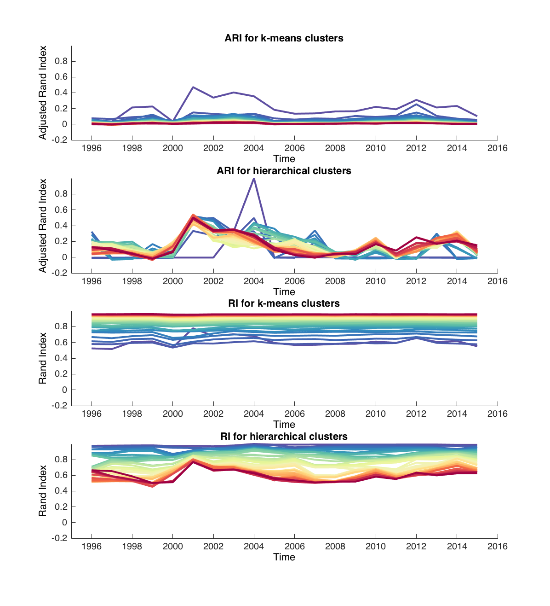
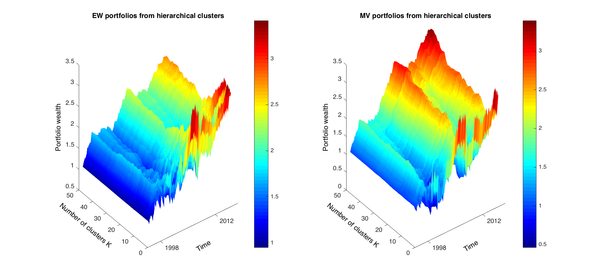
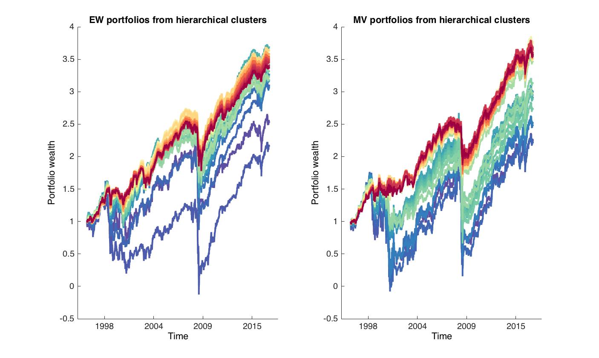

[](http://quantlet.de/)

## [](http://quantlet.de/) ** RiskProfilePortfolio** [](http://quantlet.de/)

```yaml

Name of QuantLet :  RiskProfilePortfolio

Published in : Risk profile clustering strategy in portfolio diversification

Description : 'Reproduces all calculations used in the project and plots: 1. k-mean and agglomerative clustering of stocks based on risk-profiles, constructs portfolios from stocks from separate clusters'

Keywords : cluster, portfolio, risk measure, distance meaure, k-means, agglomerative clustering, returns


See also : 'CCPTests, CCPBootstrap, CCPPerformance_measures, CCPDiversification_measures'

Author : Alla Petukhina

Submitted : June 11 2018 by Alla Petukhina
Datafile : ''stoxx600NAfulldata.mat, stoxx600EUfulldata.mat''

Example : 
```









### MATLAB Code
```matlab
%% Load data and set parameters for clustering
clc
clear
load('stoxx600NAfulldata_new') %uncomment to download American equity dataset
%load('stoxx600EUfulldata_new') %uncomment to download European equity dataset
tc            = 1-0.01; %Transaction costs for the portfolio rebalancing
clus_num      = 50; %Define range of clusters' number

kmcdist = {'cosine' }; % k-means disntaces 

hctdist = {'cosine' }; %  distances for agglomerative clustering 

hctalgo = {'single'}; % agglomerative algorithms 

clus_options = [2.0 100 0.00001 0];
alpha         = 0.05;      
rebal = 12; % rebalancing period in  months
nnshift = rebal*(0:round(length(RET_MONTH)/rebal));

%% Calculating of annual risk measures for all stocks in the sample (excluding TS with NA and zero returns)

nshift    = 0;
Datelong  = [];
emptycell = cell(1,round(length(RET_MONTH)/rebal)-12/rebal);
%crrate structure variable
YEAR = struct('DATA',emptycell, 'DATA_R', emptycell, 'TICK', emptycell, 'Date', emptycell,... 
              'Date_R', emptycell,'SIGMA',emptycell, 'SKEWN',emptycell,...
              'KURT',emptycell, 'VAR2', emptycell,'ES',emptycell, 'ALPHA', ...
               emptycell,'BETA',emptycell,'SHARPE',emptycell, 'X',emptycell,...
              'IDX_S', emptycell, 'FCM_S',emptycell, 'CMC_S',emptycell, ...
              'HCT_S',emptycell, 'INDKM_S', emptycell,'INDFCM_S', emptycell,...
              'INDHCT_S',emptycell, 'INDCMC_S', emptycell, 'KSCAPout', emptycell,...
              'FSCAPout', emptycell, 'HSCAPout',emptycell, 'CSCAPout',emptycell, 'KSCAPRET', emptycell,...
              'FSCAPRET', emptycell,'HSCAPRET', emptycell,'CSCAPRET', emptycell);


parfor n = 1:length(emptycell)
   nnshift = rebal*(0:round(length(RET_MONTH)/rebal));
    Data         = cell2mat(arrayfun(@(c) c.f1(:,:),  RET_MONTH(1+nnshift(n):12+nnshift(n)), 'Uniform', 0));
    Data_rebal   = cell2mat(arrayfun(@(c) c.f1(:,:),  RET_MONTH(13+nnshift(n):12*(n+1)), 'Uniform', 0));
    Date         = Data(:,1);
    Data         = Data(:, 2:end);
    [row,col]    = find(isnan(Data));
    row          = unique(row);
    col          = unique(col);
    ticks        = TICKS;
    %Uncomment lines for industry/mv/country for EU dataset
    country      = COUNTRY;
    industry     = INDUSTRY;
    mv           = MV_YEAR(n).f1(end,2:end);
    
    Data(:,col)   = []; % delete series with NaN    

    Date_rebal =  Data_rebal(:, 1);
    Data_rebal =  Data_rebal(:, 2:end);
    Data_rebal(:,col) = [];
    ticks(:,col) = [];
     %UNcomment lines for industry/mv/country for EU dataset
  % country(:,col) = [];
    industry(:,col) = [];
    mv(:,col)    = [];
    
 %   delete rows with zeros in more than 50% cases    
     [row2,col2] = find(sum(Data==0,2)>=round(size(Data, 2)/2,0));     
     Data(row2, :)       = [];    
     [row5,col5] = find(sum(Data_rebal==0,2)>=round(size(Data_rebal, 2)/2,0));     
     Data_rebal(row5, :)       = [];
    [row3,col3] = find(sum(Data==0,1)>=round(size(Data, 1)/3,0));   
    Data(:,col3)       = [];
    Data_rebal(:,col3) = [];
    ticks(:,col3) = [];
   % country(:,col3) = [];
    industry(:,col3) = [];
    mv(:,col3) = [];
     % check whether covar matrix is positive definite
    ii = [];
    for i=1:length(Data(:,1:end-1))
        Ht=cov(Data(:,i),Data(:,end));
        eig_Ht = eig(Ht); 
        for l = 1:rank(Ht)
            if eig_Ht(l) <= 0
            flag = 1;
            ii = [ii,i];
            end
        end
    end
   Data(:,ii)=[];
   Data_rebal(:,ii)=[];
   ticks(:,ii) = [];
  % UNcomment lines for industry/mv/country for EU dataset
  % country(:,ii) = [];
   industry(:,ii) = [];
   mv(:,ii) = [];
   
   %  UNcomment lines for industry/mv/country for EU dataset
    [row4,col4]    = find(isnan(mv));
    Data(:,col4)       = [];
    Data_rebal(:,col4) = [];
    ticks(:,col4) = [];
   
   % country(:,col4) = [];
    industry(:,col4) = [];
     mv(:,col4) = [];
 
%1 Sigma
sigma = std(Data);%Historical volatility

% 2 Skewness
skewn = skewness(Data); %Skewness

%3 Kurtosis
kurt  = kurtosis(Data);  %Kurtosis

%4 VaR   
VaR2  = prctile(Data, alpha * 100); %Historical VaR

% 5 Expected shortfall
[g,i]    = size(Data);
ES = [];
for m = 1:i
ret_year_m = Data(:, m); 
var2_m = VaR2(1, m);
es = sum(ret_year_m(ret_year_m < var2_m))/(g * alpha);  %Expected shortfall
ES = [ES,es];
end

% 6 Beta

[NumSamples, NumSeries]       = size(Data);
NumAssets                     = NumSeries - 1;%1st column -date, end column - index TS. 

Alpha = [];
Beta  = [];
for i = 1:NumAssets
	% Set up separate asset data and design matrices
	TestData   = zeros(NumSamples,1);
	TestDesign = zeros(NumSamples,2);

	TestData(:) = Data(:,i) - 0;% riskless return equals 0
	TestDesign(:,1) = 1.0;
	TestDesign(:,2) = Data(:,end)-0;% riskless return equals 0

	% Estimate CAPM for each asset separately
	[Param, Covar] = ecmmvnrmle(TestData, TestDesign);

	% Estimate ideal standard errors for covariance parameters
	[StdParam, StdCovar] = ecmmvnrstd(TestData, TestDesign, Covar, 'fisher');
	
	% Estimate sample standard errors for model parameters
	StdParam = ecmmvnrstd(TestData, TestDesign, Covar, 'hessian');

	% Set up results for output
	Alpha = [Alpha, Param(1)];
	Beta  = [Beta, Param(2)];
	Sigma = sqrt(Covar);

	StdAlpha = StdParam(1);
	StdBeta  = StdParam(2);
	StdSigma = sqrt(StdCovar);
    
end   

Sharpe = sharpe(Data,0);

X = [sigma(:,1:end-1)', skewn(:,1:end-1)',... 
                  kurt(:,1:end-1)', VaR2(:,1:end-1)',...
                  ES(:,1:end-1)', Beta'];
 %standartize 
X_STD  = bsxfun(@minus, X, mean(X));
X_STD  = bsxfun(@rdivide, X_STD, std(X));
Dist   = pdist(X_STD, cell2mat(kmcdist));

YEAR(n).DATA    = Data;
YEAR(n).DATA_R  = Data_rebal;
YEAR(n).Date_R  = Date_rebal;
YEAR(n).Date    = Date;
YEAR(n).TICK    = ticks;
YEAR(n).SIGMA   = sigma;
YEAR(n).SKEWN   = skewn;
YEAR(n).KURT    = kurt;
YEAR(n).VAR2    = VaR2;
YEAR(n).ES      = ES;
YEAR(n).ALPHA   = Alpha;
YEAR(n).BETA    = Beta;
YEAR(n).SHARPE  = Sharpe;
YEAR(n).X       = X;
YEAR(n).X_STD   = X_STD;
 %UNcomment lines for industry/mv/country for EU dataset
YEAR(n).MV     = mv;               
YEAR(n).LOGMV  = log(mv);
%YEAR(n).COUNTRY= country;
YEAR(n).INDUSTRY= industry;
YEAR(n).Dist   = Dist;
Datelong       = [Datelong;  Date_rebal];


%nnshift = nnshift + 3;   
nshift = nshift + 1 
end

%% Clustering based on absolute values of risk measures
tic

nshift = 0;
for n = 1:length(emptycell)
        X_std      = YEAR(n).X_STD; %not modified matrix
      
        
% 
        IDX_S   = {};
        HCT_S   = {};
        IDX_s   = [];
        HCT_s   = [];

%    
     for j =  2:clus_num
% 
% %k-means

    idx_s        = [];
    cent_s       = [];
    sumdist_s    = [];
    

    [idx_s_j,cent_s_j, sumdist_s_j]  = kmeans(X_std,j,'Distance', kmcdist(1));
    IDX_s   = [IDX_s, idx_s_j];
    cent_s       = [];
  % Agglomerative hierarchical cluster tree
   % Compute clusters various linkage algos and distances
    Z_s_j = linkage(X_std, hctalgo(1), hctdist(1));   
    hct_s_j = cluster(Z_s_j,'maxclust',j);                            
    HCT_s   = [HCT_s, hct_s_j]; 
    end

YEAR(n).kmcs_silhouette        = evalclusters(X_std, IDX_s, 'silhouette');
YEAR(n).kmcs_CalinskiHarabasz  = evalclusters(X_std, IDX_s, 'CalinskiHarabasz');
YEAR(n).kmcs_DaviesBouldin     = evalclusters(X_std, IDX_s, 'DaviesBouldin');

YEAR(n).hcts_silhouette        = evalclusters(X_std, HCT_s, 'silhouette');
YEAR(n).hcts_CalinskiHarabasz  = evalclusters(X_std, HCT_s, 'CalinskiHarabasz');
YEAR(n).hcts_DaviesBouldin     = evalclusters(X_std, HCT_s, 'DaviesBouldin');

nshift = nshift + 1 
    
YEAR(n).IDX_S = IDX_s;
YEAR(n).HCT_S = HCT_s;


end
toc 
%% ARI and RI dynamics
 
ARI_KMC = [];
RI_KMC  = [];
ARI_HCT = [];
RI_HCT  = [];
for n = 2:length(YEAR)
    Tick_old = YEAR(n-1).TICK(1:end-1);%the last column is index
    Tick     = YEAR(n).TICK(1:end-1);
    common = intersect(Tick,Tick_old);  
    ind         = find(ismember(Tick,common));
    ind_old         = find(ismember(Tick_old,common));
    ARI_kmc = [];
 RI_kmc  = [];
 ARI_hct = [];
 RI_hct  = [];
    for j = 1:clus_num-1
    ari_hct = rand_index( YEAR(n).HCT_S(ind,j), YEAR(n-1).HCT_S(ind_old,j), 'adjusted');
     ARI_hct = [ARI_hct,ari_hct];
     ri_hct = rand_index( YEAR(n).HCT_S(ind,j), YEAR(n-1).HCT_S(ind_old,j));
 RI_hct  = [RI_hct,ri_hct];
 ari_kmc = rand_index( YEAR(n).IDX_S(ind,j), YEAR(n-1).IDX_S(ind_old,j), 'adjusted');
     ARI_kmc = [ARI_kmc,ari_kmc];
     ri_kmc = rand_index( YEAR(n).IDX_S(ind,j), YEAR(n-1).IDX_S(ind_old,j));
 RI_kmc  = [RI_kmc,ri_kmc];
    end
     ARI_KMC = [ARI_KMC; ARI_kmc ];
 RI_KMC  = [RI_KMC; RI_kmc];
 ARI_HCT = [ARI_HCT; ARI_hct];
 RI_HCT  = [RI_HCT; RI_hct];
end
%% Buy&hold STOXX 600  for every year and for the period 
nshift = 0
INDCAPRETlong       = [];
INDCAPITlong        = [];  
for n=1:length(emptycell)
    
    IND  = YEAR(n).DATA_R(:, end);
    INDCAP(1) = 1;
    INDCAPIT  = [];

for i = 1:size(IND,1)
    
    INDCAP(i+1) = INDCAP(i)+IND(i);
    indcaplast  = INDCAP(i+1);
    INDCAPIT    = [INDCAPIT,indcaplast];      
end

YEAR(n).INDCAP       =  [1,INDCAPIT];
YEAR(n).INDSHARPE    =  sharpe(IND, 0);
INDCAPRETlong        = [INDCAPRETlong, IND'];
nshift = nshift + 1
end

IND       = INDCAPRETlong;
INDCAP(1) = 1;
INDCAPIT  = [];

for i = 1:size(IND',1)
    
    INDCAP(i+1) = INDCAP(i)+IND(i);
    indcaplast  = INDCAP(i+1);
    INDCAPIT    = [INDCAPIT,indcaplast];       
end

INDCAPITlong       = INDCAPIT;
%% Portfolio construction from maximum sharpe ratios stocks of every cluster

% Choose stocks with maximum Sharpe ratio from every cluster based on
% absolute value of risk measures

for n = 1:length(emptycell)
    Sharpe = YEAR(n).SHARPE(1, 1:end-1);
    idx    = YEAR(n).IDX_S;
    hct    = YEAR(n).HCT_S;

    indkm =  {};
    indfcm = {};
    indhct = {};
    indcmc = {};

for i = 1:size(idx, 2)    
    indkm{i}  = cell2mat(arrayfun(@(x)(find(Sharpe==max(Sharpe(1, find(idx(:,i)==x))))), unique(idx(:,i))', 'uniformoutput', false)); %for k-means clusters 
    indhct{i} = cell2mat(arrayfun(@(x)(find(Sharpe==max(Sharpe(1, find(hct(:,i)==x))))), unique(hct(:,i))', 'uniformoutput', false)); %for  Agglomerative hierarchical clustering 
end
    YEAR(n).INDKM_S    = indkm;
    YEAR(n).INDHCT_S   = indhct;

end

%% IN sample 1/n rule portfolios from maximum Sharpe ratio stocks from every cluster based on absolute values for all clusters
tic

nshift = 0


 KSCAPRETINlong    = [];

 FSCAPRETINlong    = [];

 HSCAPRETINlong    = [];

 CSCAPRETINlong    = [];

for n = 12/rebal:length(emptycell)
       
Data          = YEAR(n).DATA;
Tick          = YEAR(n).TICK;
Tick_old      = YEAR(n).TICK;

KSCAPoutall = []; 

KSCAPRET    = [];
%     
indkms_old    = YEAR(n).INDKM_S;

indhcts_old   = YEAR(n).INDHCT_S;


%Portfolios from k-means clusters 
 for i = 1:size(indkms_old, 1)*size(indkms_old, 2)
     tick_kms       = Tick_old(cell2mat(indkms_old(i)));  
     indkms         = find(ismember(Tick,tick_kms));
     ewt     = ones(size(Data(:,indkms), 2),1)./(size(Data(:,indkms), 2));
     krett   = Data(:,indkms)*ewt;
     KSCAPRET           = [KSCAPRET; krett'];
     KSCAPoutall       =  [KSCAPoutall ; 1 + cumsum(krett)']; 
 end
KSCAPRETINlong    = [KSCAPRETINlong, KSCAPRET];

HSCAPoutall = []; 
HSCAPRET    = [];
     
 for i = 1:size(indhcts_old, 1)*size(indhcts_old, 2)
    tick_hcts       = Tick_old(cell2mat(indhcts_old(i)));  
    indhcts         = find(ismember(Tick,tick_hcts));
    ewt = ones(size(Data(:,indhcts), 2),1)./(size(Data(:,indhcts), 2));
    hrett   = Data(:,indhcts)*ewt;
    HSCAPRET           = [HSCAPRET; hrett'];
    HSCAPoutall       =  [HSCAPoutall ; 1 + cumsum(hrett)'];    
end

 HSCAPRETINlong    = [HSCAPRETINlong, HSCAPRET];

YEAR(n).KSCAPIN  = KSCAPoutall;
YEAR(n).HSCAPIN  = HSCAPoutall;

YEAR(n).KSCAPRETIN  = KSCAPRET;
YEAR(n).HSCAPRETIN  = HSCAPRET;

 YEAR(n).KSHARPEIN  = find(sharpe(KSCAPRET',0)==max(sharpe(KSCAPRET',0)));
YEAR(n).HSHARPEIN  = find(sharpe(HSCAPRET',0)==max(sharpe(HSCAPRET',0)));

YEAR(n).KMAX  = find(KSCAPoutall(:,end)'==max(KSCAPoutall(:,end)'));
YEAR(n).HMAX  = find(HSCAPoutall(:,end)'==max(HSCAPoutall(:,end)'));

nshift = nshift + 1
end
toc 

%% Out of sample 1/n rule portfolios from maximum Sharpe ratio stocks from every cluster for all clusters	
tic		
		
nshift = 0		
		
 KSCAPRETALLlong    = [];		
		
 FSCAPRETlong    = [];		
		
 HSCAPRETALLlong    = [];		
		
 CSCAPRETlong    = [];	
 
 %diversification measures

 km_naive_pd_ENB_PCA = [];	
 km_naive_pd_MarginalRiskContributionsEntropy  = [];
 km_naive_pd_ENB_MT = [];
 km_naive_pd_Diversification_Delta = [];
 km_naive_pd_DiversificationRatio = [];
 km_naive_pd_PDI = [];
 

 hct_naive_pd_ENB_PCA = [];	
 hct_naive_pd_MarginalRiskContributionsEntropy  = [];
 hct_naive_pd_ENB_MT = [];
 hct_naive_pd_Diversification_Delta = [];
 hct_naive_pd_DiversificationRatio = [];
 hct_naive_pd_PDI = [];
%  
for n = 12/rebal:length(emptycell)		
   
Data          = YEAR(n).DATA_R;		
Tick          = YEAR(n).TICK;		
Tick_old      = YEAR(n).TICK;		
		
KSCAPoutall = []; 		
KSCAPRET    = [];				
indkms_old    = YEAR(n).INDKM_S;				
indhcts_old   = YEAR(n).INDHCT_S;				
km_naive_pd  = [];	
hct_naive_pd = [];			
		
for i = 1:size(indkms_old, 1)*size(indkms_old, 2)			
    tick_kms       = Tick_old(cell2mat(indkms_old(i)));  		
    indkms         = find(ismember(Tick, tick_kms));	

    kwgt = ones(size(Data(:,indkms), 2),1)./(size(Data(:,indkms), 2));
    krett   = Data(:,indkms)*kwgt;
    KSCAPRET           = [KSCAPRET; krett'];
    KSCAPoutall       =  [KSCAPoutall ; 1 + cumsum(krett)'];
    Data_cov = Data(:,indkms);
         if size(Data_cov(:,find(kwgt)),2) ~= 1
          pd=PortfolioDiversification('PortfolioWeights',kwgt,'AssetCovar',nancov(Data_cov),'AssetReturns',Data_cov,'DiversificationFunction',{'Weights',...
              'Marginal Risk Contributions','ENB_PCA','ENB_MT','Diversification Return',...
              'Portfolio Variance','Diversification Ratio','Diversification Delta' ,'Portfolio Diversification Index'});
         else

              pd=PortfolioDiversification('PortfolioWeights',kwgt,'AssetCovar',nancov(Data_cov),'AssetReturns',Data_cov,'DiversificationFunction',{'Weights',...
              'Marginal Risk Contributions','ENB_PCA','ENB_MT','Diversification Return',...
              'Portfolio Variance','Diversification Ratio','Diversification Delta'});
           pd.PDI = 1;
         end
    % Measure portfolio diversification
km_naive_pd= [km_naive_pd, MeasureDiversification(pd)];
end	
KSCAPRETALLlong    = [KSCAPRETALLlong,	 KSCAPRET];	

HSCAPoutall = []; 				
HSCAPRET    = [];		
		
 for i = 1:size(indhcts_old,	 1)*size(indhcts_old,	 2)			
    tick_hcts       = Tick_old(cell2mat(indhcts_old(i)));  		
    indhcts         = find(ismember(Tick,	tick_hcts));	
    hwgt            = ones(size(Data(:,indhcts), 2),1)./(size(Data(:,indhcts), 2));
    hrett           = Data(:,indhcts)*hwgt;
    HSCAPRET        = [HSCAPRET; hrett'];
    HSCAPoutall     =  [HSCAPoutall ; 1 + cumsum(hrett)'];		
    Data_cov = Data(:,indhcts);
         if size(Data_cov(:,find(hwgt)),2) ~= 1
          pd=PortfolioDiversification('PortfolioWeights',hwgt,'AssetCovar',nancov(Data_cov),'AssetReturns',Data_cov,'DiversificationFunction',{'Weights',...
              'Marginal Risk Contributions','ENB_PCA','ENB_MT','Diversification Return',...
              'Portfolio Variance','Diversification Ratio','Diversification Delta' ,'Portfolio Diversification Index'});
         else

              pd=PortfolioDiversification('PortfolioWeights',hwgt,'AssetCovar',nancov(Data_cov),'AssetReturns',Data_cov,'DiversificationFunction',{'Weights',...
              'Marginal Risk Contributions','ENB_PCA','ENB_MT','Diversification Return',...
              'Portfolio Variance','Diversification Ratio','Diversification Delta'});
           pd.PDI = 1;
         end
% Measure portfolio diversification
hct_naive_pd= [hct_naive_pd, MeasureDiversification(pd)];	
end		
		
HSCAPRETALLlong    = [HSCAPRETALLlong,	 HSCAPRET];	

YEAR(n).KSCAPoutALL  = KSCAPoutall;			
YEAR(n).HSCAPoutALL  = HSCAPoutall;					
		
YEAR(n).KSHARPEOUTALL = sharpe(KSCAPRET,	0);		
YEAR(n).HSHARPEOUTALL = sharpe(HSCAPRET,	0);	
		
YEAR(n).KSCAPRETALL  = KSCAPRET;				
YEAR(n).HSCAPRETALL  = HSCAPRET;

YEAR(n).KSPD_ALL  = km_naive_pd;	
YEAR(n).HSPD_ALL  = hct_naive_pd;		
		
nshift = nshift + 1		
end		
toc		

%% Out of sample 1/n rule portfolios from maximum Sharpe ratio stocks from every cluster # of clusters is based on maximum return			
nshift = 0				
KSCAPRETlong    = [];				
HSCAPRETlong    = [];		
 
for n = 12/rebal:length(emptycell)		
		
Data          = YEAR(n).DATA_R;		
Tick          = YEAR(n).TICK;		
Tick_old      = YEAR(n).TICK;			
KSCAPoutall   = []; 				
KSCAPRET      = [];				
indkms_old    = YEAR(n).INDKM_S;		
indhcts_old   = YEAR(n).INDHCT_S;				
km_naive_pd   = [];
hct_naive_pd  = [];
		
for i = YEAR(n).KMAX		
    tick_kms       = Tick_old(cell2mat(indkms_old(i)));  		
    indkms         = find(ismember(Tick, tick_kms));	
    kwgt = ones(size(Data(:,indkms), 2),1)./(size(Data(:,indkms), 2));
    krett   = Data(:,indkms)*kwgt;
    KSCAPRET           = [KSCAPRET; krett'];
    KSCAPoutall       =  [KSCAPoutall ; 1 + cumsum(krett)'];   
%      % Create PortfolioDiversification object
    Data_cov = Data(:,indkms);
         if size(Data_cov(:,find(kwgt)),2) ~= 1
          pd=PortfolioDiversification('PortfolioWeights',kwgt,'AssetCovar',nancov(Data_cov),'AssetReturns',Data_cov,'DiversificationFunction',{'Weights',...
              'Marginal Risk Contributions','ENB_PCA','ENB_MT','Diversification Return',...
              'Portfolio Variance','Diversification Ratio','Diversification Delta' ,'Portfolio Diversification Index'});
         else

              pd=PortfolioDiversification('PortfolioWeights',kwgt,'AssetCovar',nancov(Data_cov),'AssetReturns',Data_cov,'DiversificationFunction',{'Weights',...
              'Marginal Risk Contributions','ENB_PCA','ENB_MT','Diversification Return',...
              'Portfolio Variance','Diversification Ratio','Diversification Delta'});
           pd.PDI = 1;
         end
% % Measure portfolio diversification
km_naive_pd= [km_naive_pd, MeasureDiversification(pd)];
end			
KSCAPRETlong    = [KSCAPRETlong,	 KSCAPRET];		
HSCAPoutall = []; 				
HSCAPRET    = [];				
 for i = YEAR(n).HMAX
    tick_hcts       = Tick_old(cell2mat(indhcts_old(i)));  		
    indhcts         = find(ismember(Tick,	tick_hcts));	
    hwgt = ones(size(Data(:,indhcts), 2),1)./(size(Data(:,indhcts), 2));
    hrett   = Data(:,indhcts)*hwgt;
    HSCAPRET           = [HSCAPRET; hrett'];
    HSCAPoutall       =  [HSCAPoutall ; 1 + cumsum(hrett)'];		

    Data_cov = Data(:,indhcts);
         if size(Data_cov(:,find(hwgt)),2) ~= 1
          pd=PortfolioDiversification('PortfolioWeights',hwgt,'AssetCovar',nancov(Data_cov),'AssetReturns',Data_cov,'DiversificationFunction',{'Weights',...
              'Marginal Risk Contributions','ENB_PCA','ENB_MT','Diversification Return',...
              'Portfolio Variance','Diversification Ratio','Diversification Delta' ,'Portfolio Diversification Index'});
         else

              pd=PortfolioDiversification('PortfolioWeights',hwgt,'AssetCovar',nancov(Data_cov),'AssetReturns',Data_cov,'DiversificationFunction',{'Weights',...
              'Marginal Risk Contributions','ENB_PCA','ENB_MT','Diversification Return',...
              'Portfolio Variance','Diversification Ratio','Diversification Delta'});
           pd.PDI = 1;
         end
% % Measure portfolio diversification
hct_naive_pd= [hct_naive_pd, MeasureDiversification(pd)];	
end			
HSCAPRETlong    = [HSCAPRETlong,	 HSCAPRET];	

YEAR(n).KSCAPout  = KSCAPoutall;			
YEAR(n).HSCAPout  = HSCAPoutall;					
		
YEAR(n).KSHARPEOUT = sharpe(KSCAPRET,	0);	
YEAR(n).HSHARPEOUT = sharpe(HSCAPRET,	0);	
		
YEAR(n).KSCAPRET  = KSCAPRET;			
YEAR(n).HSCAPRET  = HSCAPRET;	

YEAR(n).KSPD  = km_naive_pd;	
YEAR(n).HSPD  = hct_naive_pd;		
		
nshift = nshift + 1		
end		
toc 		

%% Out of sample 1/n rule portfolios from maximum Sharpe ratio stocks from every cluster based on maximum Sharpe ratio of in-sample	portfolios	
tic		
		
nshift = 0		
		
 KSCAPRETSharpelong    = [];				
 HSCAPRETSharpelong    = [];		
		
		
for n = 12/rebal:length(emptycell)		
		
Data          = YEAR(n).DATA_R;		
Tick          = YEAR(n).TICK;		
Tick_old      = YEAR(n).TICK;		
		
KSCAPoutall = []; 		
		
KSCAPRET    = [];		
		
indkms_old    = YEAR(n).INDKM_S;				
indhcts_old   = YEAR(n).INDHCT_S;		
		
km_naive_pd  = [];
hct_naive_pd = [];
		
for i = YEAR(n).KSHARPEIN
    tick_kms       = Tick_old(cell2mat(indkms_old(i)));  		
    indkms         = find(ismember(Tick, tick_kms));	
    kwgt = ones(size(Data(:,indkms), 2),1)./(size(Data(:,indkms), 2));
    krett   = Data(:,indkms)*kwgt;
    KSCAPRET           = [KSCAPRET; krett'];
    KSCAPoutall       =  [KSCAPoutall ; 1 + cumsum(krett)'];
     
  % Create PortfolioDiversification object
    Data_cov = Data(:,indkms);
         if size(Data_cov(:,find(kwgt)),2) ~= 1
          pd=PortfolioDiversification('PortfolioWeights',kwgt,'AssetCovar',nancov(Data_cov),'AssetReturns',Data_cov,'DiversificationFunction',{'Weights',...
              'Marginal Risk Contributions','ENB_PCA','ENB_MT','Diversification Return',...
              'Portfolio Variance','Diversification Ratio','Diversification Delta' ,'Portfolio Diversification Index'});
         else

              pd=PortfolioDiversification('PortfolioWeights',kwgt,'AssetCovar',nancov(Data_cov),'AssetReturns',Data_cov,'DiversificationFunction',{'Weights',...
              'Marginal Risk Contributions','ENB_PCA','ENB_MT','Diversification Return',...
              'Portfolio Variance','Diversification Ratio','Diversification Delta'});
           pd.PDI = 1;
         end
% 

km_naive_pd= [km_naive_pd, MeasureDiversification(pd)];
end		
 		
KSCAPRETSharpelong    = [KSCAPRETSharpelong,	 KSCAPRET];	
HSCAPoutall = []; 			
HSCAPRET    = [];		
	
 for i = YEAR(n).HSHARPEIN				
tick_hcts       = Tick_old(cell2mat(indhcts_old(i)));  		
indhcts         = find(ismember(Tick,	tick_hcts));			
hwgt = ones(size(Data(:,indhcts), 2),1)./(size(Data(:,indhcts), 2));
hrett   = Data(:,indhcts)*hwgt;
HSCAPRET           = [HSCAPRET; hrett'];
HSCAPoutall       =  [HSCAPoutall ; 1 + cumsum(hrett)'];		
Data_cov = Data(:,indhcts);
     if size(Data_cov(:,find(hwgt)),2) ~= 1
      pd=PortfolioDiversification('PortfolioWeights',hwgt,'AssetCovar',nancov(Data_cov),'AssetReturns',Data_cov,'DiversificationFunction',{'Weights',...
          'Marginal Risk Contributions','ENB_PCA','ENB_MT','Diversification Return',...
          'Portfolio Variance','Diversification Ratio','Diversification Delta' ,'Portfolio Diversification Index'});
     else
         
          pd=PortfolioDiversification('PortfolioWeights',hwgt,'AssetCovar',nancov(Data_cov),'AssetReturns',Data_cov,'DiversificationFunction',{'Weights',...
          'Marginal Risk Contributions','ENB_PCA','ENB_MT','Diversification Return',...
          'Portfolio Variance','Diversification Ratio','Diversification Delta'});
       pd.PDI = 1;
    end
% 
% % Measure portfolio diversification
hct_naive_pd= [hct_naive_pd, MeasureDiversification(pd)];	

end			
HSCAPRETSharpelong    = [HSCAPRETSharpelong,	 HSCAPRET];	
YEAR(n).KSCAPSharpeout  = KSCAPoutall;				
YEAR(n).HSCAPSharpeout  = HSCAPoutall;		

YEAR(n).KSHARPEOUTSharpe = sharpe(KSCAPRET,	0);	
YEAR(n).HSHARPEOUTSharpe = sharpe(HSCAPRET,	0);		
		
YEAR(n).KSCAPRETSharpe  = KSCAPRET;			
YEAR(n).HSCAPRETSharpe  = HSCAPRET;			

YEAR(n).KSPDSharpe  = km_naive_pd;	
YEAR(n).HSPDSharpe  = hct_naive_pd;		
		
nshift = nshift + 1		
end		
toc 	


%% Out of sample 1/n rule portfolios from maximum Sharpe ratio stocks from every cluster based on Calinski-Harabasz
tic		
		
nshift = 0		
		
 KSCAPRETlong_CH    = [];		
 HSCAPRETlong_CH    = [];		
		
for n = 12/rebal:length(emptycell)		
		
Data          = YEAR(n).DATA_R;		
Tick          = YEAR(n).TICK;		
Tick_old      = YEAR(n).TICK;		
		
KSCAPoutall = []; 		
		
KSCAPRET    = [];		
		
indkms_old    = YEAR(n).INDKM_S;				
		
indhcts_old   = YEAR(n).INDHCT_S;			
km_naive_pd  = [];
hct_naive_pd = [];
		
for i = YEAR(n).kmcs_CalinskiHarabasz.OptimalK
		
		
    tick_kms       = Tick_old(cell2mat(indkms_old(i)));  		
    indkms         = find(ismember(Tick, tick_kms));	
    kwgt           = ones(size(Data(:,indkms), 2),1)./(size(Data(:,indkms), 2));
    krett          = Data(:,indkms)*kwgt;
    KSCAPRET       = [KSCAPRET; krett'];
    KSCAPoutall    =  [KSCAPoutall ; 1 + cumsum(krett)'];
     
%      % Create PortfolioDiversification object
    Data_cov = Data(:,indkms);
         if size(Data_cov(:,find(kwgt)),2) ~= 1
          pd=PortfolioDiversification('PortfolioWeights',kwgt,'AssetCovar',nancov(Data_cov),'AssetReturns',Data_cov,'DiversificationFunction',{'Weights',...
              'Marginal Risk Contributions','ENB_PCA','ENB_MT','Diversification Return',...
              'Portfolio Variance','Diversification Ratio','Diversification Delta' ,'Portfolio Diversification Index'});
         else

              pd=PortfolioDiversification('PortfolioWeights',kwgt,'AssetCovar',nancov(Data_cov),'AssetReturns',Data_cov,'DiversificationFunction',{'Weights',...
              'Marginal Risk Contributions','ENB_PCA','ENB_MT','Diversification Return',...
              'Portfolio Variance','Diversification Ratio','Diversification Delta'});
           pd.PDI = 1;
         end
% % Measure portfolio diversification
km_naive_pd= [km_naive_pd, MeasureDiversification(pd)];
end		
		
% 		
KSCAPRETlong_CH    = [KSCAPRETlong_CH,	 KSCAPRET];			
HSCAPoutall = []; 				
HSCAPRET    = [];				
 for i = YEAR(n).hcts_CalinskiHarabasz.OptimalK
	
    tick_hcts       = Tick_old(cell2mat(indhcts_old(i)));  		
    indhcts         = find(ismember(Tick,	tick_hcts));	
    hwgt            = ones(size(Data(:,indhcts), 2),1)./(size(Data(:,indhcts), 2));
    hrett           = Data(:,indhcts)*hwgt;
    HSCAPRE         = [HSCAPRET; hrett'];
    HSCAPoutall     =  [HSCAPoutall ; 1 + cumsum(hrett)'];		

    Data_cov = Data(:,indhcts);
         if size(Data_cov(:,find(hwgt)),2) ~= 1
          pd=PortfolioDiversification('PortfolioWeights',hwgt,'AssetCovar',nancov(Data_cov),'AssetReturns',Data_cov,'DiversificationFunction',{'Weights',...
              'Marginal Risk Contributions','ENB_PCA','ENB_MT','Diversification Return',...
              'Portfolio Variance','Diversification Ratio','Diversification Delta' ,'Portfolio Diversification Index'});
         else

              pd=PortfolioDiversification('PortfolioWeights',hwgt,'AssetCovar',nancov(Data_cov),'AssetReturns',Data_cov,'DiversificationFunction',{'Weights',...
              'Marginal Risk Contributions','ENB_PCA','ENB_MT','Diversification Return',...
              'Portfolio Variance','Diversification Ratio','Diversification Delta'});
           pd.PDI = 1;
        end
% 
% % Measure portfolio diversification
hct_naive_pd= [hct_naive_pd, MeasureDiversification(pd)];	
end		
  hct_naive_pd_DiversificationRatio = [hct_naive_pd_DiversificationRatio, hct_naive_pd.DiversificationRatio];
		
HSCAPRETlong_CH    = [HSCAPRETlong_CH,	 HSCAPRET];	
 YEAR(n).KSCAPout_CH  = KSCAPoutall;			
YEAR(n).HSCAPout_CH  = HSCAPoutall;			
			
YEAR(n).KSHARPEOUT_CH = sharpe(KSCAPRET,	0);	
YEAR(n).HSHARPEOUT_CH = sharpe(HSCAPRET,	0);	
		
YEAR(n).KSCAPRET_CH  = KSCAPRET;			
YEAR(n).HSCAPRET_CH  = HSCAPRET;		

YEAR(n).KSPD_CH  = km_naive_pd;		
YEAR(n).HSPD_CH  = hct_naive_pd;		
nshift = nshift + 1		
end		
toc 	
%% IN sample Mean-variance portfolios from maximum Sharpe ratio stocks from every cluster based on absolute values 
tic
nshift = 0

 KSMVCAPRETINlong    = [];
 HSMVCAPRETINlong    = [];
 
for n = 12/rebal:length(emptycell)
    Data          = YEAR(n).DATA;
    Tick          = YEAR(n).TICK;
    Tick_old      = YEAR(n).TICK;

    KSMVCAPoutall = []; 

    FSMVCAPoutall = []; 

    HSMVCAPoutall = []; 

    CSMVCAPoutall   = []; 

    KSMVCAPRET    = [];

    FSMVCAPRET    = [];

    CSMVCAPRET    = [];

    HSMVCAPRET    = [];

    Kswgt = {}; 
    Hswgt = {}; 
    indkms_old    = YEAR(n).INDKM_S;
    indhcts_old   = YEAR(n).INDHCT_S;
    num_dig       = 4;
    TargRet       = 0.8;
    options       = optimset( 'Display','off', 'Algorithm','active-set','MaxFunEvals',100000);

 for i = 1:size(indkms_old, 1)*size(indkms_old, 2)

% 
    tick_kms       = Tick(cell2mat(indkms_old(i)));  %tickers in rebalancing period (future, do not be confused by _old
    indkms_adj         = find(ismember(Tick_old,tick_kms)); %tickers are in both period
    indkms     = find(ismember(Tick, Tick_old(indkms_adj)));

XI             = Data(:,indkms);
portf_km       = Portfolio('AssetMean', mean(XI),'AssetCovar', ...
                              cov(XI),...
                               'LowerBudget', 1, 'UpperBudget', 1, 'LowerBound', ...
                               zeros(1, size(XI, 2)));
kswgt            = round(estimateMaxSharpeRatio(portf_km)*10^7)/10^7;
Kswgt{i}         = kswgt;
krett            = Data(:,indkms)*kswgt;       
KSMVCAPoutall    =  [KSMVCAPoutall; 1 + cumsum(krett)']; 
KSMVCAPRET       = [KSMVCAPRET; krett'];

 end
 KSMVCAPRETINlong    = [KSMVCAPRETINlong, KSMVCAPRET];

 for i = 1:size(indhcts_old, 1)*size(indhcts_old, 2)
    indhcts_adj = find(ismember(Tick_old,tick_hcts)); %tickers are in both period
    indhcts     = find(ismember(Tick, Tick_old(indhcts_adj)));

    HSMVCAPout  = []; 
    hscappp   = [];
    hscap{1}  = 1; 
    hscapp(1) = 1;
    hrett     = [];

XI              = Data(:,indhcts);
portf_hct       = Portfolio('AssetMean', mean(XI),'AssetCovar', ...
                                 cov(XI), 'LowerBudget', 1, 'UpperBudget', 1, 'LowerBound', ...
                                 zeros(1, size(XI, 2)));
hswgt            = round(estimateMaxSharpeRatio(portf_hct)*10^7)/10^7; 
Hswgt{i}         = hswgt;
hrett            = Data(:,indhcts)*hswgt;
HSMVCAPoutall    =  [HSMVCAPoutall; 1 + cumsum(hrett)']; 
 HSMVCAPRET      = [HSMVCAPRET; hrett'];
 end

 HSMVCAPRETINlong    = [HSMVCAPRETINlong, HSMVCAPRET];

YEAR(n).KSWGT  = Kswgt;
YEAR(n).HSWGT  = Hswgt;


 YEAR(n).KSMVCAPIN  = KSMVCAPoutall;
YEAR(n).HSMVCAPIN  = HSMVCAPoutall;

 YEAR(n).KSMVCAPRET  = KSMVCAPRET;
YEAR(n).HSMVCAPRET  = HSMVCAPRET;

 YEAR(n).KMVSHARPEIN  = find(sharpe(KSMVCAPRET',0)==max(sharpe(KSMVCAPRET',0)));
YEAR(n).HMVSHARPEIN  = find(sharpe(HSMVCAPRET',0)==max(sharpe(HSMVCAPRET',0)));

 YEAR(n).KMVMAX  = find(KSMVCAPoutall(:,end)'==max(KSMVCAPoutall(:,end)'));
YEAR(n).HMVMAX  = find(HSMVCAPoutall(:,end)'==max(HSMVCAPoutall(:,end)'));

nshift = nshift + 1
end
toc %ca 

%% Out of sample Mean-variance portfolios from maximum Sharpe ratio stocks from every cluster for all clusters 
tic
nshift = 0
KSMVCAPRETALLlong  = [];
HSMVCAPRETALLlong  = [];
for n = 12/rebal:length(emptycell)
Data_old      = YEAR(n).DATA;
Data          = YEAR(n).DATA_R;
Tick          = YEAR(n).TICK;
Tick_old      = YEAR(n).TICK;

KSMVCAPoutall = []; 
HSMVCAPoutall = []; 
KSMVCAPRET    = [];
CSMVCAPRET    = [];
indkms_old    = YEAR(n).INDKM_S;
indhcts_old   = YEAR(n).INDHCT_S;

num_dig       = 4;
TargRet       = 0.8;
options       = optimset('Display', 'off','Algorithm','active-set','MaxFunEvals',100000);


for i = 1:size(indkms_old, 1)*size(indkms_old, 2)


tick_kms       = Tick_old(cell2mat(indkms_old(i))); 
indkms         = find(ismember(Tick,tick_kms));
indkms_adj     = find(ismember(Tick_old, Tick(indkms)));


KSMVCAPout  = []; 
kscappp   = [];
kscap{1}  = 1; 
kscapp(1) = 1;
krett     = [];
kswgt     = YEAR(n).KSWGT{1,i};
krett            = Data(:,indkms_adj)*kswgt;
 
    KSMVCAPoutall      =  1+cumsum(krett)'; 
    KSMVCAPRET      = [KSMVCAPRET; krett']; 
    Data_cov = Data(:,indkms);
     if size(Data_cov(:,find(kswgt)),2) ~= 1
          pd=PortfolioDiversification('PortfolioWeights',kswgt,'AssetCovar',nancov(Data_cov),'AssetReturns',Data_cov,'DiversificationFunction',{'Weights',...
          'Marginal Risk Contributions','ENB_PCA','ENB_MT','Diversification Return',...
          'Portfolio Variance','Diversification Ratio','Diversification Delta' ,'Portfolio Diversification Index'});
     else
         
          pd=PortfolioDiversification('PortfolioWeights',kswgt,'AssetCovar',nancov(Data_cov),'AssetReturns',Data_cov,'DiversificationFunction',{'Weights',...
          'Marginal Risk Contributions','ENB_PCA','ENB_MT','Diversification Return',...
          'Portfolio Variance','Diversification Ratio','Diversification Delta'});
       pd.PDI = 1;
     end
% Measure portfolio diversification
km_mv_pd=MeasureDiversification(pd);	

 end
% 
 KSMVCAPRETALLlong = [KSMVCAPRETALLlong, KSMVCAPRET];

for i = 1:size(indhcts_old, 1)*size(indhcts_old, 2)
tick_hcts       = Tick_old(cell2mat(indhcts_old(i)));  
indhcts         = find(ismember(Tick,tick_hcts));
indhcts_adj     = find(ismember(Tick_old, Tick(indhcts)));
hswgt     = YEAR(n).HSWGT{1,i};        
hrett            = Data(:,indhcts)*hswgt;
 HSMVCAPoutall      =  1+cumsum(hrett)'; 
   HSMVCAPRET      = [HSMVCAPRET; hrett']; 

     Data_cov = Data(:,indhcts);
     if size(Data_cov(:,find(hswgt)),2) ~= 1
      pd=PortfolioDiversification('PortfolioWeights',hswgt,'AssetCovar',nancov(Data_cov),'AssetReturns',Data_cov,'DiversificationFunction',{'Weights',...
          'Marginal Risk Contributions','ENB_PCA','ENB_MT','Diversification Return',...
          'Portfolio Variance','Diversification Ratio','Diversification Delta' ,'Portfolio Diversification Index'});
     else
         
          pd=PortfolioDiversification('PortfolioWeights',hswgt,'AssetCovar',nancov(Data_cov),'AssetReturns',Data_cov,'DiversificationFunction',{'Weights',...
          'Marginal Risk Contributions','ENB_PCA','ENB_MT','Diversification Return',...
          'Portfolio Variance','Diversification Ratio','Diversification Delta'});
       pd.PDI = 1;
     end
% 
% % Measure portfolio diversification
hct_mv_pd=MeasureDiversification(pd);

end

  HSMVCAPRETALLlong = [HSMVCAPRETALLlong, HSMVCAPRET];

YEAR(n).KSMVCAPoutALL  = KSMVCAPoutall;				
YEAR(n).HSMVCAPoutALL  = HSMVCAPoutall;			
		
YEAR(n).KSMVHARPEOUTALL = sharpe(KSMVCAPRET,	0);		
YEAR(n).HSMVHARPEOUTALL = sharpe(HSMVCAPRET,	0);		
		
YEAR(n).KSMVCAPRETALL  = KSMVCAPRET;			
YEAR(n).HSMVCAPRETALL  = HSMVCAPRET;		

YEAR(n).KSPDMV_ALL  = km_mv_pd;	
YEAR(n).HSPDMV_ALL  = hct_mv_pd; 
nshift = nshift + 1
end
toc %ca 

%% Out of sample Mean-variance portfolios from maximum Sharpe ratio stocks from every cluster #of clusters based on max in-sample return
tic
nshift = 0
 KSMVCAPRETlong    = [];
 HSMVCAPRETlong    = [];


for n = 12/rebal:length(emptycell)
Data_old      = YEAR(n).DATA;
Data          = YEAR(n).DATA_R;
Tick          = YEAR(n).TICK;
Tick_old      = YEAR(n).TICK;

KSMVCAPoutall = []; 
HSMVCAPoutall = []; 
KSMVCAPRET    = [];
HSMVCAPRET    = [];
 indkms_old    = YEAR(n).INDKM_S;
indhcts_old   = YEAR(n).INDHCT_S;
num_dig       = 4;
TargRet       = 0.8;
options       = optimset('Display', 'off','Algorithm','active-set','MaxFunEvals',100000);

for i = YEAR(n).KMVMAX

tick_kms       = Tick_old(cell2mat(indkms_old(i))); 
indkms         = find(ismember(Tick,tick_kms));
indkms_adj     = find(ismember(Tick_old, Tick(indkms)));


KSMVCAPout  = []; 
kscappp   = [];
kscap{1}  = 1; 
kscapp(1) = 1;
krett     = [];
kswgt     = YEAR(n).KSWGT{1,i};
krett            = Data(:,indkms_adj)*kswgt;
    end
% 
     KSMVCAPoutall      =  1+cumsum(krett)'; 
    KSMVCAPRET      = [krett]'; 
%     
    Data_cov = Data(:,indkms);
     if size(Data_cov(:,find(kswgt)),2) ~= 1
          pd=PortfolioDiversification('PortfolioWeights',kswgt,'AssetCovar',nancov(Data_cov),'AssetReturns',Data_cov,'DiversificationFunction',{'Weights',...
          'Marginal Risk Contributions','ENB_PCA','ENB_MT','Diversification Return',...
          'Portfolio Variance','Diversification Ratio','Diversification Delta' ,'Portfolio Diversification Index'});
     else
         
          pd=PortfolioDiversification('PortfolioWeights',kswgt,'AssetCovar',nancov(Data_cov),'AssetReturns',Data_cov,'DiversificationFunction',{'Weights',...
          'Marginal Risk Contributions','ENB_PCA','ENB_MT','Diversification Return',...
          'Portfolio Variance','Diversification Ratio','Diversification Delta'});
       pd.PDI = 1;
     end
% Measure portfolio diversification
km_mv_pd=MeasureDiversification(pd);

 KSMVCAPRETlong    = [KSMVCAPRETlong, KSMVCAPRET];

for i = YEAR(n).HMVMAX
tick_hcts       = Tick_old(cell2mat(indhcts_old(i)));  
indhcts         = find(ismember(Tick,tick_hcts));

indhcts_adj     = find(ismember(Tick_old, Tick(indhcts)));

HSMVCAPout  = []; 
hscappp   = [];
hscap{1}  = 1; 
hscapp(1) = 1;
hrett     = [];
hswgt     = YEAR(n).HSWGT{1,i};

        
          hrett            = Data(:,indhcts)*hswgt;
     HSMVCAPoutall      =  1+cumsum(hrett)'; 
    HSMVCAPRET      = [hrett]';
     Data_cov = Data(:,indhcts);
     if size(Data_cov(:,find(hswgt)),2) ~= 1
      pd=PortfolioDiversification('PortfolioWeights',hswgt,'AssetCovar',nancov(Data_cov),'AssetReturns',Data_cov,'DiversificationFunction',{'Weights',...
          'Marginal Risk Contributions','ENB_PCA','ENB_MT','Diversification Return',...
          'Portfolio Variance','Diversification Ratio','Diversification Delta' ,'Portfolio Diversification Index'});
     else
         
          pd=PortfolioDiversification('PortfolioWeights',hswgt,'AssetCovar',nancov(Data_cov),'AssetReturns',Data_cov,'DiversificationFunction',{'Weights',...
          'Marginal Risk Contributions','ENB_PCA','ENB_MT','Diversification Return',...
          'Portfolio Variance','Diversification Ratio','Diversification Delta'});
       pd.PDI = 1;
     end
% 
% % Measure portfolio diversification
hct_mv_pd=MeasureDiversification(pd);

end

 HSMVCAPRETlong    = [HSMVCAPRETlong, HSMVCAPRET];

 YEAR(n).KSMVCAPout  = KSMVCAPoutall;
 YEAR(n).HSMVCAPout  = HSMVCAPoutall;
% 
YEAR(n).KSMVCAPRETout  = KSMVCAPRET;
YEAR(n).HSMVCAPRETout  = HSMVCAPRET;
% 
 YEAR(n).KSWGTout  = Kswgt;
 YEAR(n).HSWGTout  = Hswgt;
nshift = nshift + 1
end
toc %ca 

%% Out of sample Mean-variance portfolios from maximum Sharpe ratio stocks from every cluster #of clusters based on max in-sample Sharpe
tic
nshift = 0

for n = 12/rebal:length(emptycell)
Data_old      = YEAR(n).DATA;
Data          = YEAR(n).DATA_R;
Tick          = YEAR(n).TICK;
Tick_old      = YEAR(n).TICK;

KSMVCAPoutall = []; 
HSMVCAPoutall = []; 
KSMVCAPRET    = [];
HSMVCAPRET    = [];

indkms_old    = YEAR(n).INDKM_S;
indhcts_old   = YEAR(n).INDHCT_S;

num_dig       = 4;
TargRet       = 0.8;
options       = optimset('Display', 'off','Algorithm','active-set','MaxFunEvals',100000);


for i = YEAR(n).KMVSHARPEIN

tick_kms       = Tick_old(cell2mat(indkms_old(i))); 
indkms         = find(ismember(Tick,tick_kms));
indkms_adj     = find(ismember(Tick_old, Tick(indkms)));


KSMVCAPout  = []; 
kscappp   = [];
kscap{1}  = 1; 
kscapp(1) = 1;
krett     = [];
kswgt     = YEAR(n).KSWGT{1,i};
   
          krett            = Data(:,indkms_adj)*kswgt;
    end
%  
    KSMVCAPoutall      =  1+cumsum(krett)'; 
    KSMVCAPRET      = [krett]'; 
%     
    Data_cov = Data(:,indkms);
     if size(Data_cov(:,find(kswgt)),2) ~= 1
          pd=PortfolioDiversification('PortfolioWeights',kswgt,'AssetCovar',nancov(Data_cov),'AssetReturns',Data_cov,'DiversificationFunction',{'Weights',...
          'Marginal Risk Contributions','ENB_PCA','ENB_MT','Diversification Return',...
          'Portfolio Variance','Diversification Ratio','Diversification Delta' ,'Portfolio Diversification Index'});
     else
         
          pd=PortfolioDiversification('PortfolioWeights',kswgt,'AssetCovar',nancov(Data_cov),'AssetReturns',Data_cov,'DiversificationFunction',{'Weights',...
          'Marginal Risk Contributions','ENB_PCA','ENB_MT','Diversification Return',...
          'Portfolio Variance','Diversification Ratio','Diversification Delta'});
       pd.PDI = 1;
     end
% Measure portfolio diversification
km_mv_pd=MeasureDiversification(pd);

KSMVCAPRETSharpelong    = [KSMVCAPRETSharpelong, KSMVCAPRET];


for i = YEAR(n).HMVSHARPEIN
    tick_hcts       = Tick_old(cell2mat(indhcts_old(i)));  
    indhcts         = find(ismember(Tick,tick_hcts));
    indhcts_adj     = find(ismember(Tick_old, Tick(indhcts)));
    HSMVCAPout  = []; 
    hscappp   = [];
    hscap{1}  = 1; 
    hscapp(1) = 1;
    hrett     = [];
    hswgt     = YEAR(n).HSWGT{1,i};
    hrett            = Data(:,indhcts)*hswgt;

     HSMVCAPoutall      =  1+cumsum(hrett)';
    HSMVCAPRET      = [hrett]';

     Data_cov = Data(:,indhcts);
     if size(Data_cov(:,find(hswgt)),2) ~= 1
      pd=PortfolioDiversification('PortfolioWeights',hswgt,'AssetCovar',nancov(Data_cov),'AssetReturns',Data_cov,'DiversificationFunction',{'Weights',...
          'Marginal Risk Contributions','ENB_PCA','ENB_MT','Diversification Return',...
          'Portfolio Variance','Diversification Ratio','Diversification Delta' ,'Portfolio Diversification Index'});
     else
         
          pd=PortfolioDiversification('PortfolioWeights',hswgt,'AssetCovar',nancov(Data_cov),'AssetReturns',Data_cov,'DiversificationFunction',{'Weights',...
          'Marginal Risk Contributions','ENB_PCA','ENB_MT','Diversification Return',...
          'Portfolio Variance','Diversification Ratio','Diversification Delta'});
       pd.PDI = 1;
     end
% 
% % Measure portfolio diversification
hct_mv_pd=MeasureDiversification(pd);
	

end

HSMVCAPRETSharpelong    = [HSMVCAPRETSharpelong, HSMVCAPRET];
YEAR(n).KSMVCAPSharpe  = KSMVCAPoutall;
YEAR(n).HSMVCAPSharpe  = HSMVCAPoutall;
% 
YEAR(n).KSMVCAPRETSharpe  = KSMVCAPRET;
YEAR(n).HSMVCAPRETSharpe  = HSMVCAPRET;
% 
YEAR(n).KSWGTSharpe  = Kswgt;
YEAR(n).HSWGTSharpe  = Hswgt;

nshift = nshift + 1
end
toc %ca 

%% Out of sample Mean-variance portfolios from maximum Sharpe ratio stocks from every cluster #of clusters based on Calinski-Harabasz
tic
nshift = 0
 
 KSMVCAPRETlong_CH    = [];
 HSMVCAPRETlong_CH    = [];

for n = 12/rebal:length(emptycell)
Data_old      = YEAR(n).DATA;
Data          = YEAR(n).DATA_R;
Tick          = YEAR(n).TICK;
Tick_old      = YEAR(n).TICK;

KSMVCAPoutall = []; 
HSMVCAPoutall = []; 

KSMVCAPRET    = [];
HSMVCAPRET    = [];

indkms_old    = YEAR(n).INDKM_S;
indhcts_old   = YEAR(n).INDHCT_S;
num_dig       = 4;
TargRet       = 0.8;
options       = optimset('Display', 'off','Algorithm','active-set','MaxFunEvals',100000);

for i = YEAR(n).kmcs_CalinskiHarabasz.OptimalK

tick_kms       = Tick_old(cell2mat(indkms_old(i))); 
indkms         = find(ismember(Tick,tick_kms));
indkms_adj     = find(ismember(Tick_old, Tick(indkms)));


KSMVCAPout  = []; 
kscappp   = [];
kscap{1}  = 1; 
kscapp(1) = 1;
krett     = [];
kswgt     = YEAR(n).KSWGT{1,i};
krett            = Data(:,indkms_adj)*kswgt;
    end

     KSMVCAPoutall      =  1+cumsum(krett)'; 

    Data_cov = Data(:,indkms);
     if size(Data_cov(:,find(kswgt)),2) ~= 1
          pd=PortfolioDiversification('PortfolioWeights',kswgt,'AssetCovar',nancov(Data_cov),'AssetReturns',Data_cov,'DiversificationFunction',{'Weights',...
          'Marginal Risk Contributions','ENB_PCA','ENB_MT','Diversification Return',...
          'Portfolio Variance','Diversification Ratio','Diversification Delta' ,'Portfolio Diversification Index'});
     else
         
          pd=PortfolioDiversification('PortfolioWeights',kswgt,'AssetCovar',nancov(Data_cov),'AssetReturns',Data_cov,'DiversificationFunction',{'Weights',...
          'Marginal Risk Contributions','ENB_PCA','ENB_MT','Diversification Return',...
          'Portfolio Variance','Diversification Ratio','Diversification Delta'});
       pd.PDI = 1;
     end
% Measure portfolio diversification
km_mv_pd=MeasureDiversification(pd);

KSMVCAPRETlong_CH    = [KSMVCAPRETlong_CH, KSMVCAPRET];

for i = YEAR(n).hcts_CalinskiHarabasz.OptimalK


tick_hcts       = Tick_old(cell2mat(indhcts_old(i)));  
indhcts         = find(ismember(Tick,tick_hcts));

indhcts_adj     = find(ismember(Tick_old, Tick(indhcts)));

HSMVCAPout  = []; 
hscappp   = [];
hscap{1}  = 1; 
hscapp(1) = 1;
hrett     = [];
hswgt     = YEAR(n).HSWGT{1,i};

        
hrett            = Data(:,indhcts)*hswgt;

 HSMVCAPoutall      =  1+cumsum(hrett)'; 
 HSMVCAPRET      = [hrett]';

     Data_cov = Data(:,indhcts);
     if size(Data_cov(:,find(hswgt)),2) ~= 1
      pd=PortfolioDiversification('PortfolioWeights',hswgt,'AssetCovar',nancov(Data_cov),'AssetReturns',Data_cov,'DiversificationFunction',{'Weights',...
          'Marginal Risk Contributions','ENB_PCA','ENB_MT','Diversification Return',...
          'Portfolio Variance','Diversification Ratio','Diversification Delta' ,'Portfolio Diversification Index'});
     else
         
          pd=PortfolioDiversification('PortfolioWeights',hswgt,'AssetCovar',nancov(Data_cov),'AssetReturns',Data_cov,'DiversificationFunction',{'Weights',...
          'Marginal Risk Contributions','ENB_PCA','ENB_MT','Diversification Return',...
          'Portfolio Variance','Diversification Ratio','Diversification Delta'});
       pd.PDI = 1;
     end
% 
% % Measure portfolio diversification
hct_mv_pd=MeasureDiversification(pd);

end

 HSMVCAPRETlong_CH    = [HSMVCAPRETlong_CH, HSMVCAPRET];
%
 YEAR(n).KSMVCAPout_CH  = KSMVCAPoutall;
 YEAR(n).HSMVCAPout_CH  = HSMVCAPoutall;
% 
YEAR(n).KSMVCAPRETout_CH  = KSMVCAPRET;
YEAR(n).HSMVCAPRETout_CH  = HSMVCAPRET;
% 
 YEAR(n).KSWGTout_CH  = Kswgt;
 YEAR(n).HSWGTout_CH  = Hswgt;

nshift = nshift + 1
end
toc %ca
%%  Portfolio construction from random stocks of every cluster
tic
num_sim = 100
nshift = 0


for n=1:length(emptycell)

    idxs          = YEAR(n).IDX_S;
    hcts          = YEAR(n).HCT_S;

    RANDINDKM_S    = [];
   
    RANDINDHCT_S   = [];
    
    
    for l = 1:num_sim 
 
        %K-means

        RANDINDKMJ_S     = [];

    
        for j=1:length(kmcdist) 
            indkms = {};
            idxs    = YEAR(n).IDX_S(:,1+(clus_num-1)*(j-1):j*(clus_num-1));

            for i = 1:size(idxs, 2)
                randindkms = []; 
            
                for m = 1:size(unique(idxs(:,i))',2)

                    H = find(idxs(:,i)==m);
    
                    randindkms(m) = H(randi(numel(H)));

                end

                Randindkms{i} = randindkms;
            end

       RANDINDKMJ_S     = [RANDINDKMJ_S; Randindkms];


    end

   RANDINDKM_S     = [RANDINDKM_S; RANDINDKMJ_S];


 % Agglomerative 
        RANDINDHCTJ_S     = [];
        hcts   = YEAR(n).HCT_S;
            
            for i = 1:size(hcts, 2)
                randindhcts = []; 
            
                for m = 1:size(unique(hcts(:,i))',2)
                
                    H = find(hcts(:,i)==m);

                    randindhcts(m) = H(randi(numel(H)));

                end
                Randindhcts{i} = randindhcts;
           end

    RANDINDHCTJ_S     = [RANDINDHCTJ_S; Randindhcts];
    RANDINDHCT_S     = [RANDINDHCT_S; RANDINDHCTJ_S];
 end

YEAR(n).RANDINDKM_S   = RANDINDKM_S;
YEAR(n).RANDINDHCT_S   = RANDINDHCT_S;

nshift = nshift + 1
end
toc 

%% Random out of sample 1/n rule portfolios  from every cluster based on absolute values 
tic

nshift = 0

for n = 1:length(emptycell)
       
Data          = YEAR(n).DATA_R;		
Tick          = YEAR(n).TICK;		
Tick_old      = YEAR(n).TICK;	

parfor k = 1:num_sim 
 
    KSCAPoutall = []; 
    KSCAPRET    = [];
    indkms_old    = YEAR(n).RANDINDKM_S(((k-1)*size(kmcdist,2)+1):k*size(kmcdist,2),:);
    indhcts_old   = YEAR(n).RANDINDHCT_S(((k-1)*length(hctdist)*length(hctalgo)+1):k*length(hctdist)*length(hctalgo),:);

%Portfolios from k-means clusters 
for i = 1:size(indkms_old, 1)*size(indkms_old, 2)

    tick_kms       = Tick_old(cell2mat(indkms_old(i)));  
    indkms         = find(ismember(Tick,tick_kms));
    kwgt           = ones(size(Data(:,indkms), 2),1)./(size(Data(:,indkms), 2));
    krett          = Data(:,indkms)*kwgt;
    KSCAPRET       = [KSCAPRET; krett'];
    KSCAPoutall    =  [KSCAPoutall ; 1 + cumsum(krett)'];
     
 
end

HSCAPoutall = []; 

HSCAPRET    = [];
     
 for i = 1:size(indhcts_old, 1)*size(indhcts_old, 2)
    tick_hcts       = Tick_old(cell2mat(indhcts_old(i)));  
    indhcts         = find(ismember(Tick,tick_hcts));

hwgt = ones(size(Data(:,indhcts), 2),1)./(size(Data(:,indhcts), 2));
hrett   = Data(:,indhcts)*hwgt;
 HSCAPRET           = [HSCAPRET; hrett'];
 HSCAPoutall       =  [HSCAPoutall ; 1 + cumsum(hrett)'];		

 end
RKSCAPout{k} = KSCAPoutall;
RHSCAPout{k} = HSCAPoutall;
RKSCAPRET{k} = KSCAPRET;
RHSCAPRET{k} = HSCAPRET;

end

YEAR(n).RKSCAPout  = RKSCAPout;
YEAR(n).RHSCAPout  = RHSCAPout;
YEAR(n).RKSCAPRET  = RKSCAPRET;
YEAR(n).RHSCAPRET  = RHSCAPRET;

nshift = nshift + 1
end
toc %ca 

%% Random out of sample MV rule portfolios  from every cluster based on absolute values
 disp('Random out of sample MV rule portfolios  from every cluster based on absolute values')
tic

nshift = 0

for n = 1:length(emptycell)
Data_old      = YEAR(n).DATA;       
Data          = YEAR(n).DATA_R;		
Tick          = YEAR(n).TICK;		
Tick_old      = YEAR(n).TICK;	

parfor k = 1:num_sim 

    KSCAPoutall = []; 
    KSCAPRET    = [];
    indkms_old    = YEAR(n).RANDINDKM_S(((k-1)*size(kmcdist,2)+1):k*size(kmcdist,2),:);
    indhcts_old   = YEAR(n).RANDINDHCT_S(((k-1)*length(hctdist)*length(hctalgo)+1):k*length(hctdist)*length(hctalgo),:);

Kswgt = {};
Hswgt = {};
%Portfolios from k-means clust ers 
for i = 1:size(indkms_old, 1)*size(indkms_old, 2)
    tick_kms       = Tick_old(cell2mat(indkms_old(i)));  
    indkms         = find(ismember(Tick,tick_kms));
    indkms_adj     = find(ismember(Tick_old, Tick(indkms)));
    XI              = Data_old(:,indkms_adj);
    if size(XI,2)==0
          kwgt       =0;
          krett      = Data(:,(indkms))*kwgt;  
     else

    portf_km       = Portfolio('AssetMean', nanmean(XI),'AssetCovar', ...
                                  nancov(XI),...
                                   'LowerBudget', 1, 'UpperBudget', 1, 'LowerBound', ...
                                   zeros(1, size(XI, 2)));
    kwgt       = round(estimateMaxSharpeRatio(portf_km)*10^7)/10^7;       
    krett      = Data(:, (indkms))*kwgt;
    Kswgt{i}   = kwgt;
    end

end
 
    
%Portfolios from hct clusters with 
 
HSCAPoutall = []; 

HSCAPRET    = [];
     
 for i = 1:size(indhcts_old, 1)*size(indhcts_old, 2)


tick_hcts       = Tick_old(cell2mat(indhcts_old(i)));  
indhcts         = find(ismember(Tick,tick_hcts));
indhcts_adj      = find(ismember(Tick_old, Tick(indhcts)));

 XI               = Data_old(:,indhcts_adj);
 if size(XI,2)==0
       hwgt       =0;
       hrett      = Data(:,(indhcts))*hwgt;  
 else
     
  portf_hct       = Portfolio('AssetMean', nanmean(XI),'AssetCovar', ...
                              nancov(XI),...
                               'LowerBudget', 1, 'UpperBudget', 1, 'LowerBound', ...
                               zeros(1, size(XI, 2)));
hwgt       = round(estimateMaxSharpeRatio(portf_hct)*10^7)/10^7;
     
         hrett      = Data(:,(indhcts))*hwgt;  
          Hswgt{i}         = hwgt;
 end

     HSCAPRET    = [ HSCAPRET; hrett'];
     HSCAPoutall = [HSCAPoutall; 1 + cumsum(hrett)']; 

end
 
RKWGT{k} = Kswgt;
RHWGT{k} = Hswgt;

RKSCAPout{k} = KSCAPoutall;
RHSCAPout{k} = HSCAPoutall;
RKSCAPRET{k} = KSCAPRET;
RHSCAPRET{k} = HSCAPRET;

end

YEAR(n).RKMVSCAPout  = RKSCAPout;
YEAR(n).RHMVSCAPout  = RHSCAPout;

YEAR(n).RKMVCAPRET  = RKSCAPRET;
YEAR(n).RHMVCAPRET  = RHSCAPRET;

YEAR(n).RKWGT  = RKWGT;
YEAR(n).RHWGT  = RHWGT;

nshift = nshift + 1
end
toc %ca 


%% Construction of average returns for 1/n and MV rules for random portfolios
RKCAPRET_MEAN_LONG   = [];
RKMVCAPRET_MEAN_LONG = [];
RHCAPRET_MEAN_LONG   = [];
RHMVCAPRET_MEAN_LONG = [];
for  n = 1:length(emptycell)
RKCAPRET_MEAN =  mean(reshape(cell2mat(YEAR(n).RKSCAPRET), [ size(YEAR(n).RKSCAPRET{1}), length(YEAR(n).RKSCAPRET) ]), ndims(YEAR(n).RKSCAPRET{1})+1);    
RHCAPRET_MEAN =  mean(reshape(cell2mat(YEAR(n).RHSCAPRET), [ size(YEAR(n).RHSCAPRET{1}), length(YEAR(n).RHSCAPRET) ]), ndims(YEAR(n).RHSCAPRET{1})+1);  
RKMVCAPRET_MEAN = mean(reshape(cell2mat(YEAR(n).RKMVCAPRET), [ size(YEAR(n).RKMVCAPRET{1}), length(YEAR(n).RKMVCAPRET) ]), ndims(YEAR(n).RKMVCAPRET{1})+1);   
RHMVCAPRET_MEAN = mean(reshape(cell2mat(YEAR(n).RHMVCAPRET), [ size(YEAR(n).RHMVCAPRET{1}), length(YEAR(n).RHMVCAPRET) ]), ndims(YEAR(n).RHMVCAPRET{1})+1); 
RKCAPRET_MEAN_LONG   = [RKCAPRET_MEAN_LONG, RKCAPRET_MEAN];
RKMVCAPRET_MEAN_LONG = [RKMVCAPRET_MEAN_LONG, RHCAPRET_MEAN];
RHCAPRET_MEAN_LONG   = [RHCAPRET_MEAN_LONG,RKMVCAPRET_MEAN];
RHMVCAPRET_MEAN_LONG = [RHMVCAPRET_MEAN_LONG,RHMVCAPRET_MEAN];
end
RKCAP   = 1 + cumsum(RKCAPRET_MEAN_LONG , 2);
RKMVCAP =  1 + cumsum(RKMVCAPRET_MEAN_LONG , 2);
RHCAP   =  1 + cumsum(RHCAPRET_MEAN_LONG , 2);
RHMVCAP =  1 + cumsum(RHMVCAPRET_MEAN_LONG , 2);

%% Portfolio construction from maximum sharpe ratios stocks from country/industry

%Choose stocks with maximum Sharpe ratio from every cluster based on
%absolute value of risk measures

for n = 1:length(emptycell)
Sharpe = YEAR(n).SHARPE(1, 1:end-1);
%country    = YEAR(n).COUNTRY;
industry = YEAR(n).INDUSTRY;
%indcountry  = cell2mat(arrayfun(@(x)datasample((find(Sharpe==max(Sharpe(1, find(countidx(:,:)== x))))),1), unique(countidx)', 'uniformoutput', false)); %for country clusters 
indindustry = cell2mat(arrayfun(@(x) datasample((find(Sharpe==max(Sharpe(1, find(industry(:,:)== x))))),1), unique(industry)', 'uniformoutput', false)); %for industry clusters
YEAR(n).INDINDUSTRY   = indindustry;
%YEAR(n).INDCOUNTRY    = indcountry;
end

%% Out sample 1/n rule portfolios from maximum Sharpe ratio stocks from every indutry/country
tic
nshift = 0
 INDUSTCAPRETOUTlong    = [];

 COUNTCAPRETOUTlong    = [];

 industry_naive_pd_ENB_PCA = [];	
 industry_naive_pd_ENB_MT  = [];
industry_naive_pd_DiversificationRatio = [];
 
 country_naive_pd_ENB_PCA = [];	
 country_naive_pd_ENB_MT  = [];
 country_naive_pd_DiversificationRatio = [];

for n = 12/rebal:length(emptycell)
       
Data          = YEAR(n).DATA_R;
Tick          = YEAR(n).TICK;
Tick_old      = YEAR(n).TICK;

indindustry = YEAR(n).INDINDUSTRY;
%%uncomment lines below for European dataset
%indcountry = YEAR(n).INDCOUNTRY;
% tick_country       = Tick_old(indcountry);  
% indcountry         = find(ismember(Tick,tick_country));
% 
% 
% KSCAPout  = []; 
% KSCAPoutall  = []; 
% kscappp   = [];
% kscap{1}  = 1; 
% kscapp(1) = 1;
% 
% krett     = [];
% 
% 
% 
% for l = 1:size(Data,1)  
%     
%      kwgt       = (repmat(1/length(indcountry),1,length(indcountry)));
%      kscap{l}   = sum(cell2mat(kscap(l)));
%      kscap{l+1} = sum(cell2mat(kscap(l)))+sum(kwgt.*Data(l,(indcountry)));
%      kscapp     = kscap{l+1};
%      kscappp    = [kscappp,kscapp]; 
%      kret       = sum(kwgt.*Data(l,(indcountry)));
%      krett      = [krett, kret];
% end   
% 

%      
%      KSCAPout      = [1,kscappp]; 
%      KSCAPRET      = [krett]';
%      KSCAPoutall   = [KSCAPoutall; KSCAPout]; 
% 
%   COUNTCAPRETOUTlong    = [COUNTCAPRETOUTlong; KSCAPRET];
% 
% Data_cov = Data(:,indcountry);
%      if size(Data_cov(:,find(kwgt)),2) ~= 1
%           pd=PortfolioDiversification('PortfolioWeights',kwgt(find(kwgt))','AssetCovar',cov(Data_cov(:,find(kwgt))),'AssetReturns',Data_cov(:,find(kwgt)),'DiversificationFunction',{'Weights',...
%           'Marginal Risk Contributions','ENB_PCA','ENB_MT','Diversification Ratio'});%,'Diversification Return',...          'Portfolio Variance','Diversification Ratio','Diversification Delta'
%      else
%          
%           pd=PortfolioDiversification('PortfolioWeights',kwgt(find(kwgt))','AssetCovar',cov(Data_cov(:,find(kwgt))),'AssetReturns',Data_cov(:,find(kwgt)),'DiversificationFunction',{'Weights',...
%           'Marginal Risk Contributions','ENB_PCA','ENB_MT','Diversification Ratio'});%,'Diversification Return',...          'Portfolio Variance','Diversification Ratio','Diversification Delta'
%      end
%      
%      % Measure portfolio diversification
% country_naive_pd=MeasureDiversification(pd);
FSCAPout     = []; 
FSCAPoutall  = []; 
fscappp      = [];
fscap{1}     = 1; 
fscapp(1)    = 1;
frett        = [];


tick_industry      = Tick_old(indindustry);  
indindustry        = find(ismember(Tick,tick_industry));


for l = 1:size(Data,1)  
    
     kwgt     = (repmat(1/length(indindustry),1,length(indindustry)));     
     fscap{l}   = sum(cell2mat(fscap(l)));
     fscap{l+1} = sum(cell2mat(fscap(l)))+sum(kwgt.*Data(l,(indindustry)));
     fscapp     = fscap{l+1};
     fscappp    = [fscappp,fscapp]; 
     fret       = sum(kwgt.*Data(l,(indindustry)));
     frett      = [frett, fret];
end   


     FSCAPout    = [1, fscappp]; 
     FSCAPRET    = [frett]';
     FSCAPoutall = [FSCAPoutall; FSCAPout]; 

 INDUSTCAPRETOUTlong   = [ INDUSTCAPRETOUTlong; FSCAPRET];
Data_cov = Data(:,indindustry);
     if size(Data_cov(:,find(kwgt)),2) ~= 1
          pd=PortfolioDiversification('PortfolioWeights',kwgt(find(kwgt))','AssetCovar',cov(Data_cov(:,find(kwgt))),'AssetReturns',Data_cov(:,find(kwgt)),'DiversificationFunction',{'Weights',...
          'Marginal Risk Contributions','ENB_PCA','ENB_MT','Diversification Ratio'});%,'Diversification Return',...          'Portfolio Variance','Diversification Ratio','Diversification Delta' ,'Portfolio Diversification Index'
     else
         
          pd=PortfolioDiversification('PortfolioWeights',kwgt(find(kwgt))','AssetCovar',cov(Data_cov(:,find(kwgt))),'AssetReturns',Data_cov(:,find(kwgt)),'DiversificationFunction',{'Weights',...
          'Marginal Risk Contributions','ENB_PCA','ENB_MT','Diversification Ratio'});%,'Diversification Return',...          'Portfolio Variance','Diversification Ratio','Diversification Delta'
     end
     
     % Measure portfolio diversification
industry_naive_pd=MeasureDiversification(pd);

%YEAR(n).COUNTRYCAPOUT  = KSCAPoutall;
YEAR(n).INDUSTRYCAPOUT  = FSCAPoutall;

YEAR(n).INDUSTRYPD  = industry_naive_pd;
%YEAR(n).COUNTRYPD  = country_naive_pd;

%YEAR(n).COUNTRYCAPRETOUT  = KSCAPRET';
YEAR(n).INDUSTRYCAPRETOUT  = FSCAPRET';

%YEAR(n).COUNTRYSHARPEOUT  = sharpe(KSCAPRET',0);
YEAR(n).INDUSTRYHARPEOUT  = sharpe(FSCAPRET',0);

%YEAR(n).COUNTRYMAX  = find(KSCAPoutall(:,end)'==max(KSCAPoutall(:,end)'));
YEAR(n).INDUSTRYMAX  = find(FSCAPoutall(:,end)'==max(FSCAPoutall(:,end)'));

nshift = nshift + 1


 industry_naive_pd_ENB_PCA = [industry_naive_pd_ENB_PCA, industry_naive_pd.ENB_PCA ];	
 industry_naive_pd_ENB_MT  = [industry_naive_pd_ENB_MT, industry_naive_pd.ENB_MT];
 industry_naive_pd_DiversificationRatio = [industry_naive_pd_DiversificationRatio, industry_naive_pd.DiversificationRatio];

 
%  country_naive_pd_ENB_PCA = [country_naive_pd_ENB_PCA, country_naive_pd.ENB_PCA];	
%  country_naive_pd_ENB_MT  = [country_naive_pd_ENB_MT, country_naive_pd.ENB_MT];
%  country_naive_pd_DiversificationRatio = [country_naive_pd_DiversificationRatio, country_naive_pd.DiversificationRatio];

end
toc %ca 7 min

%% Out of sample Mean-variance portfolios from maximum Sharpe ratio stocks from every country/industry
nshift = 0

 industry_mv_pd_ENB_PCA = [];	
 industry_mv_pd_ENB_MT  = [];
industry_mv_pd_DiversificationRatio = [];
 
%  country_mv_pd_ENB_PCA = [];	
%  country_mv_pd_ENB_MT  = [];
% country_mv_pd_DiversificationRatio = [];
 INDUSTMVCAPRETlong    = [];
 COUNTMVCAPRETlong    = [];


for n = 12/rebal:length(emptycell)
Data_old      = YEAR(n).DATA;
Data          = YEAR(n).DATA_R;
Tick          = YEAR(n).TICK;
Tick_old      = YEAR(n).TICK;

INDUSTMVCAPoutall = []; 

COUNTMVCAPoutall = []; 


INDUSTMVCAPRET    = [];

COUNTMVCAPRET    = [];


indindustry_old = YEAR(n).INDINDUSTRY;
%indcountry_old  = YEAR(n).INDCOUNTRY;

num_dig       = 4;
TargRet       = 0.8;
options       = optimset('Display', 'off','Algorithm','active-set','MaxFunEvals',100000);

%%UNcomment lines below for European dataset

%for i = YEAR(n-1).KMVMAX %1:size(indkm_old, 1)*size(indkm_old, 2)


% tick_country       = Tick_old(indcountry_old); 
% indcountry         = find(ismember(Tick,tick_country));
% 
% indcountry_adj     = find(ismember(Tick_old, Tick(indcountry)));
% 
% 
% KSMVCAPout  = []; 
% KSMVCAPoutall  = []; 
% kscappp   = [];
% kscap{1}  = 1; 
% kscapp(1) = 1;
% krett     = [];
% 
% 
%        XI               = Data_old(:,indcountry_adj);
%       
%       
% portf_country   = Portfolio('AssetMean', mean(XI),'AssetCovar', ...
%                                  cov(XI), 'LowerBudget', 1, 'UpperBudget', 1, 'LowerBound', ...
%                                  zeros(1, size(XI, 2)));
% cswgt       = round(estimateMaxSharpeRatio(portf_country)*10^7)/10^7;
%         w0               = ones(1,size(XI,2))./size(XI,2);
%         MeanRet          = mean(XI)';
%         Ht               = cov(XI);    
%         ub               = ones(length(w0),1);
%         lb               = zeros(length(w0),1);
%         Aeq              = ones(1,length(w0));
%         beq              = 1;
%         AA               = -MeanRet';
%         bb               = -quantile(MeanRet,TargRet);
% 
%         [kswgt,iVaR]     = fmincon(@(w)(sqrt(w*Ht*w')),w0,AA,bb,Aeq,beq,lb,ub,[],options);
%         kswgt            = round(kswgt.*(10^num_dig))./(10^num_dig);
%         Kswgt        = kswgt;
% 
% 
%     for l = 1:size(Data,1)  
%          
% 
%         
%         kscap{l}         = sum(cell2mat(kscap(l)));    
%         kscap{l+1}       = sum(cell2mat(kscap(l)))+sum(kswgt.*Data(l,indcountry));
%         kscapp           = kscap{l+1};    
%         kscappp          = [kscappp,kscapp];
%         kret             = sum(kswgt.*Data(l,indcountry));
%         krett            = [krett, kret];
%     end

%     krett = Data(:,indcountry)*cswgt;
% %     KSMVCAPout      = [1,kscappp]; 
%     KSMVCAPoutall   = 1+ cumsum(krett)'; 
%     KSMVCAPRET      = [ krett]'; 
%     
%     Data_cov = Data(:,indcountry);
%      if size(Data_cov(:,find(cswgt)),2) ~= 1
%           pd=PortfolioDiversification('PortfolioWeights',cswgt(find(cswgt)),'AssetCovar',cov(Data_cov(:,find(cswgt))),'AssetReturns',Data_cov(:,find(cswgt)),'DiversificationFunction',{'Weights',...
%           'Marginal Risk Contributions','ENB_PCA','ENB_MT','Diversification Return',...
%           'Portfolio Variance','Diversification Ratio','Diversification Delta' ,'Portfolio Diversification Index'});
%      else
%          
%           pd=PortfolioDiversification('PortfolioWeights',cswgt(find(cswgt)),'AssetCovar',cov(Data_cov(:,find(cswgt))),'AssetReturns',Data_cov(:,find(cswgt)),'DiversificationFunction',{'Weights',...
%           'Marginal Risk Contributions','ENB_PCA','ENB_MT','Diversification Return',...
%           'Portfolio Variance','Diversification Ratio','Diversification Delta'});
%      end
% % Measure portfolio diversification
% country_mv_pd=MeasureDiversification(pd);


%end


 %COUNTMVCAPRETlong   = [COUNTMVCAPRETlong, KSMVCAPRET];


%for i = YEAR(n-1).FMVMAX%1:size(indfcm_old, 1)*size(indfcm_old, 2)


tick_industry       = Tick_old(indindustry_old);  
indindustry      = find(ismember(Tick,tick_industry));

indindustry_adj     = find(ismember(Tick_old, Tick(indindustry)));


FSMVCAPout  = [];
FSMVCAPoutall  = []; 
fscappp   = [];
fscap{1}  = 1; 
fscapp(1) = 1;
frett     = []

XI               = Data_old(:,indindustry_adj);
      
portf_industry   = Portfolio('AssetMean', mean(XI),'AssetCovar', ...
                                 cov(XI), 'LowerBudget', 1, 'UpperBudget', 1, 'LowerBound', ...
                                 zeros(1, size(XI, 2)));
iswgt       = round(estimateMaxSharpeRatio(portf_industry)*10^7)/10^7;

      
        Iswgt{i}         = iswgt;
        
         frett            = Data(:,indindustry)*iswgt;

     FSMVCAPoutall      =  1+cumsum(frett)'; 
    FSMVCAPRET      = [frett]'; 

    
     Data_cov = Data(:,indindustry);
     if size(Data_cov(:,find(iswgt)),2) ~= 1
          pd=PortfolioDiversification('PortfolioWeights',iswgt(find(iswgt)),'AssetCovar',cov(Data_cov(:,find(iswgt))),'AssetReturns',Data_cov(:,find(iswgt)),'DiversificationFunction',{'Weights',...
          'Marginal Risk Contributions','ENB_PCA','ENB_MT','Diversification Return',...
          'Portfolio Variance','Diversification Ratio','Diversification Delta' ,'Portfolio Diversification Index'});
     else
         
     pd=PortfolioDiversification('PortfolioWeights',iswgt(find(iswgt)),'AssetCovar',cov(Data_cov(:,find(iswgt))),'AssetReturns',Data_cov(:,find(iswgt)),'DiversificationFunction',{'Weights',...
          'Marginal Risk Contributions','ENB_PCA','ENB_MT','Diversification Return',...
          'Portfolio Variance','Diversification Ratio','Diversification Delta'});
     end
% Measure portfolio diversification
industry_mv_pd=MeasureDiversification(pd);

INDUSTMVCAPRETlong    = [INDUSTMVCAPRETlong, FSMVCAPRET];

%YEAR(n).COUNTRYMVCAPout  = KSMVCAPoutall;
YEAR(n).INDUSTRYMVCAPout  = FSMVCAPoutall;


%YEAR(n).COUNTRYMVCAPRETout  = KSMVCAPRET;
YEAR(n).INDUSTRYMVCAPRETout  = FSMVCAPRET;


YEAR(n).INDUSTRYWGTout  = Iswgt;
%YEAR(n).COUNTRYWGTout  = Cswgt;
	

 industry_mv_pd_ENB_PCA = [industry_mv_pd_ENB_PCA, industry_mv_pd.ENB_PCA];	
 industry_mv_pd_ENB_MT  = [industry_mv_pd_ENB_MT, industry_mv_pd.ENB_MT];
industry_mv_pd_DiversificationRatio  = [industry_mv_pd_DiversificationRatio, industry_mv_pd.DiversificationRatio];
 

nshift = nshift + 1
end
toc %ca 

%% Cumulative returns construction
KSCAPALLlong       = 1 + cumsum(KSCAPRETALLlong, 2);
KSCAPINlong        = 1 + cumsum(KSCAPRETINlong, 2);
KSCAPlong          = 1 + cumsum(KSCAPRETlong, 2);
KSCAPSharpelong    = 1 + cumsum(KSCAPRETSharpelong, 2);
KSCAPlong_CH       = 1 + cumsum(KSCAPRETlong_CH, 2);
KSMVCAPlong_CH     = 1 + cumsum(KSMVCAPRETlong_CH, 2);
KSMVCAPALLlong     = 1 + cumsum(KSMVCAPRETALLlong, 2);
KSMVCAPINlong      = 1 + cumsum(KSMVCAPRETINlong, 2);
KSMVCAPlong        = 1 + cumsum(KSMVCAPRETlong, 2);
KSMVCAPSharpelong  = 1 + cumsum(KSMVCAPRETSharpelong, 2);
HSCAPlong_CH          = 1 + cumsum(HSCAPRETlong_CH, 2);
HSMVCAPlong_CH          = 1 + cumsum(HSMVCAPRETlong_CH, 2);
HSCAPALLlong       = 1 + cumsum(HSCAPRETALLlong, 2);
HSCAPINlong        = 1 + cumsum(HSCAPRETINlong, 2);
HSCAPlong          = 1 + cumsum(HSCAPRETlong, 2);
HSCAPSharpelong    = 1 + cumsum(HSCAPRETSharpelong, 2);
HSMVCAPALLlong     = 1 + cumsum(HSMVCAPRETALLlong, 2);
HSMVCAPINlong      = 1 + cumsum(HSMVCAPRETINlong, 2);
HSMVCAPlong        = 1 + cumsum(HSMVCAPRETlong, 2);
HSMVCAPSharpelong  = 1 + cumsum(HSMVCAPRETSharpelong, 2);
COUNTMVCAPlong = 1+ cumsum(COUNTMVCAPRETlong,2);
COUNTCAPOUTlong = 1+ cumsum(COUNTCAPRETOUTlong',2);
INDUSTMVCAPlong = 1+ cumsum(INDUSTMVCAPRETlong,2);
INDUSTCAPOUTlong = 1+ cumsum(INDUSTCAPRETOUTlong', 2);
A = table(KSCAPlong(end), KSCAPSharpelong(end), KSCAPlong_CH(end),...
      KSMVCAPlong(end), KSMVCAPSharpelong(end), KSMVCAPlong_CH(end),...
HSCAPlong(end), HSCAPSharpelong(end), HSCAPlong_CH(end),...
      HSMVCAPlong(end), HSMVCAPSharpelong(end), HSMVCAPlong_CH(end), ...
      COUNTMVCAPlong(end), COUNTCAPOUTlong(end),...
       INDUSTMVCAPlong(end), INDUSTCAPOUTlong(end));% 
%% Construction of average returns for 1/n and MV rules for random portfolios
RKCAPRET_MEAN_LONG   = [];
RKMVCAPRET_MEAN_LONG = [];
RHCAPRET_MEAN_LONG   = [];
RHMVCAPRET_MEAN_LONG = [];
for  n = 1:length(emptycell)
RKCAPRET_MEAN =  mean(reshape(cell2mat(YEAR(n).RKSCAPRET), [ size(YEAR(n).RKSCAPRET{1}), length(YEAR(n).RKSCAPRET) ]), ndims(YEAR(n).RKSCAPRET{1})+1);    
RHCAPRET_MEAN = mean(reshape(cell2mat(YEAR(n).RHSCAPRET), [ size(YEAR(n).RHSCAPRET{1}), length(YEAR(n).RHSCAPRET) ]), ndims(YEAR(n).RHSCAPRET{1})+1);  
RKMVCAPRET_MEAN =  mean(reshape(cell2mat(YEAR(n).RKMVCAPRET), [ size(YEAR(n).RKMVCAPRET{1}), length(YEAR(n).RKMVCAPRET) ]), ndims(YEAR(n).RKMVCAPRET{1})+1);   
RHMVCAPRET_MEAN = mean(reshape(cell2mat(YEAR(n).RHMVCAPRET), [ size(YEAR(n).RHMVCAPRET{1}), length(YEAR(n).RHMVCAPRET) ]), ndims(YEAR(n).RHMVCAPRET{1})+1); 
RKCAPRET_MEAN_LONG   = [RKCAPRET_MEAN_LONG, RKCAPRET_MEAN];
RKMVCAPRET_MEAN_LONG = [RKMVCAPRET_MEAN_LONG, RHCAPRET_MEAN];
RHCAPRET_MEAN_LONG   = [RHCAPRET_MEAN_LONG,RKMVCAPRET_MEAN];
RHMVCAPRET_MEAN_LONG = [RHMVCAPRET_MEAN_LONG,RHMVCAPRET_MEAN];
end
RKCAP   = 1 + cumsum(RKCAPRET_MEAN_LONG ,2);
RKMVCAP =  1 + cumsum(RKMVCAPRET_MEAN_LONG ,2);
RHCAP   =  1 + cumsum(RHCAPRET_MEAN_LONG ,2);
RHMVCAP =  1 + cumsum(RHMVCAPRET_MEAN_LONG ,2);
%% Distances matrices vizualization K-means
close all
pfig = figure
for n=1:length(YEAR)
    subplot(3,7,n)
   X_STD = YEAR(n).X_STD;
   X_STD = sortrows([X_STD, YEAR(n).IDX_S(:,YEAR(n).kmcs_CalinskiHarabasz.OptimalK)])
   Dist   = pdist(X_STD(:,1:6), 'cosine');

   imagesc(squareform(Dist)) 
   %colorbar
   title(strcat(num2str(1994+n),': K = ', num2str(YEAR(n).kmcs_CalinskiHarabasz.OptimalK)))
   YEAR(n).Dist = Dist;
   % heatmap(squareform(Dist))
end
orient(pfig,'landscape'); 
saveas(pfig, strcat('EU_kmcdist_',cell2mat(kmcdist),'_kmc','.pdf'))
saveas(pfig, strcat('EU_kmcdist_',cell2mat(kmcdist),'_kmc','.png'))

%% Distances matrices vizualization agglomerative algo
close all
pfig = figure
for n=1:length(YEAR)
    subplot(3,7,n)
   X_STD = YEAR(n).X_STD;
   X_STD = sortrows([X_STD, YEAR(n).IDX_S(:,YEAR(n).hcts_CalinskiHarabasz.OptimalK)]);
    Dist   = pdist(X_STD(:,1:6), 'cosine');
   
  %  colormap(hot)
   imagesc(squareform(Dist)) 
   %colorbar
   title(strcat(num2str(1994+n),': K = ', num2str(YEAR(n).hcts_CalinskiHarabasz.OptimalK)))
   YEAR(n).Dist = Dist;
   % heatmap(squareform(Dist))
end
orient(pfig,'landscape'); 
saveas(pfig, strcat('EU_hctdist_',cell2mat(kmcdist),'_hct','.pdf'))
saveas(pfig, strcat('EU_hctdist_',cell2mat(kmcdist),'_hct','.png'))

%% Plots of time varying portfolios 1/N k-means
close all
CH_number = [];
COUNTRY_number = [];
INDUSTRY_number = [];
for n=1:length(YEAR)
CH_number = [CH_number, YEAR(n).kmcs_CalinskiHarabasz.OptimalK];
%COUNTRY_number = [COUNTRY_number, length(unique(YEAR(n).COUNTRY))];
INDUSTRY_number = [INDUSTRY_number, length(unique(YEAR(n).INDUSTRY))];
end
Datelong =  PRICE(252:end,1)+693960;
lineThick = 2
timerange = [Datelong(end+1-size(KSCAPlong,2))-366, Datelong(end)+366];
pfig =  figure
subplot(4,1,1)       % add first plot in 2 x 1 grid
plot(Datelong(end+1-size(KSCAPlong,2):end),KSCAPlong','-','Color','r','LineWidth',lineThick)
xlabel('Time')
datetick('x','yyyy', 'keepticks')
ylabel('Portfolio Wealth')
xlabel('Time')
title('EW portfolios from k-means clusters')
hold on
xlim(timerange)
plot(Datelong(end+1-size(KSCAPlong,2):end),KSCAPSharpelong','-','Color','b','LineWidth',lineThick)
plot(Datelong(end+1-size(KSCAPlong,2):end), KSCAPlong_CH','-','Color',color8,'LineWidth',lineThick)
%plot(Datelong,FSCAPTCoutlong_tv,'Color','b', 'LineWidth',lineThick)
 plot(Datelong(end+1-size(KSCAPlong,2):end),INDUSTCAPOUTlong','-','Color',color6, 'LineWidth',lineThick)
  plot(Datelong(end+1-size(KSCAPlong,2):end),COUNTCAPOUTlong,'Color','m','LineWidth',lineThick)
  plot(Datelong(end+1-size(KSCAPlong,2):end),INDCAPITlong','-','Color','k', 'LineWidth',lineThick)
hold off
 
subplot(4,1,2)

plot(Datelong(end+1-size(KSCAPlong,2):end),HSCAPlong','Color','r','LineWidth',lineThick)
xlabel('Time')
datetick('x','yyyy', 'keepticks')
ylabel('Portfolio Wealth')
title('EW portfolios from hierarchical clusters')
hold on
 xlim(timerange)
plot(Datelong(end+1-size(KSCAPlong,2):end),HSCAPSharpelong','Color','b','LineWidth',lineThick)
plot(Datelong(end+1-size(KSCAPlong,2):end), HSCAPlong_CH','Color',color8,'LineWidth',lineThick)
% plot(Datelong,FSCAPTCoutlong_tv,'Color','b', 'LineWidth',lineThick)
 plot(Datelong(end+1-size(KSCAPlong,2):end),INDUSTCAPOUTlong','Color',color6,'LineWidth',lineThick)
 plot(Datelong(end+1-size(KSCAPlong,2):end),COUNTCAPOUTlong','Color','m','LineWidth',lineThick)
 plot(Datelong(end+1-size(KSCAPlong,2):end),INDCAPITlong','-','Color','k', 'LineWidth',lineThick)
hold off

subplot(4,1,3)


plot(Datelong(end+1-size(KSCAPlong,2):end),KSMVCAPlong','Color','r','LineWidth',lineThick)
xlabel('Time')
datetick('x','yyyy', 'keeplimits','keepticks')
ylabel('Portfolio Wealth')
title('MV portfolios from k-means clusters')
hold on
 xlim([timerange])
plot(Datelong(end+1-size(KSCAPlong,2):end),KSMVCAPSharpelong','Color','b','LineWidth',lineThick)
plot(Datelong(end+1-size(KSCAPlong,2):end), KSCAPlong_CH','Color',color8,'LineWidth',lineThick)
% plot(Datelong,FSCAPTCoutlong_tv,'Color','b', 'LineWidth',lineThick)
 plot(Datelong(end+1-size(KSCAPlong,2):end),INDUSTMVCAPlong','Color',color6,'LineWidth',lineThick)
 plot(Datelong(end+1-size(KSCAPlong,2):end),COUNTMVCAPlong','Color','m','LineWidth',lineThick)
 plot(Datelong(end+1-size(KSCAPlong,2):end),INDCAPITlong','-','Color','k', 'LineWidth',lineThick)
hold off

subplot(4,1,4)  

plot(Datelong(end+1-size(KSCAPlong,2):end),HSMVCAPlong','Color','r','LineWidth',lineThick)
xlabel('Time')
datetick('x','yyyy', 'keepticks')
ylabel('Portfolio Wealth')
title('MV portfolios from hierarchical clusters')
hold on
 xlim([timerange])
plot(Datelong(end+1-size(KSCAPlong,2):end),HSMVCAPSharpelong','Color','b','LineWidth',lineThick)
plot(Datelong(end+1-size(KSCAPlong,2):end), HSCAPlong_CH','Color',color8,'LineWidth',lineThick)
% plot(Datelong,FSCAPTCoutlong_tv,'Color','b', 'LineWidth',lineThick)
 plot(Datelong(end+1-size(KSCAPlong,2):end),INDUSTMVCAPlong','Color',color6,'LineWidth',lineThick)
 plot(Datelong(end+1-size(KSCAPlong,2):end),COUNTMVCAPlong','Color','m','LineWidth',lineThick)
 plot(Datelong(end+1-size(KSCAPlong,2):end),INDCAPITlong','-','Color','k', 'LineWidth',lineThick)
hold off

  pfig.PaperPositionMode = 'auto'
pfig_pos = pfig.PaperPosition;
pfig.PaperSize = [pfig_pos(3) pfig_pos(4)];
saveas(pfig, strcat('cum_ret_portfolios_EU','.eps'))
saveas(pfig, strcat('cum_ret_portfolios_EU','.png'))
%% Cum return for 2-50 clusters KMC

C = linspecer(clus_num-1);
C([1,9,19,29,39,49],:); %colors for 2,10,20,30,40 and 50 clusters 
lineThick = 2
Date_long_num = datenum(num2str(Datelong(end+1-size(KSCAPlong,2):end)),'yyyymmdd')';
timerange = [Date_long_num(1)-366, Date_long_num(end)+366];
%plot(X,Y,'linewidth',5)
pfig = figure
subplot(1,2,1)
for n = 1:clus_num-1
   hold on  
plot(Date_long_num, KSCAPALLlong(n,:)','color', C(n,:),'LineWidth', lineThick)
ylabel('Portfolio wealth')
xlabel('Time')

title('EW portfolios from k-means clusters')
datetick('x','yyyy', 'keepticks')
xlim(timerange)
hold off
end

subplot(1,2,2)
for n = 1:clus_num-1
   hold on  
plot(Date_long_num, KSMVCAPALLlong(n,:)','color', C(n,:),'LineWidth', lineThick)
ylabel('Portfolio wealth')
xlabel('Time')
title('MV portfolios from k-means clusters')
datetick('x','yyyy', 'keepticks')
 xlim(timerange)
hold off
end
%orient(pfig,'landscape'); 
pfig.PaperPositionMode = 'auto'
pfig_pos = pfig.PaperPosition;
pfig.PaperSize = [pfig_pos(3) pfig_pos(4)];
saveas(pfig, strcat('cum_ret_portfolios_all_NA_KMC','.eps'))
saveas(pfig, strcat('cum_ret_portfolios_all_NA_KMC','.png'))

%% RI and ARI return for 2-50 clusters HCT
close all

C = linspecer(clus_num-1);
C([1,9,19,29,39,49],:); %colors for 2,10,20,30,40 and 50 clusters 
lineThick = 2
Date_long_num = datenum(num2str(Datelong(end+1-size(HSCAPlong,2):end)),'yyyymmdd')';
timerange = [Date_long_num(1)-366, Date_long_num(end)+366];
%plot(X,Y,'linewidth',5)
pfig = figure
subplot(4,1,1)
for n = 1:size(ARI_KMC,2)
   hold on     

plot([1996:2015], ARI_KMC(:,n)','color', C(n,:),'LineWidth', lineThick)
ylabel('Adjusted Rand Index')
xlabel('Time')
title('ARI for k-means clusters')
%datetick('x','yyyy', 'keepticks')
xlim([1995 2016])
ylim([-0.2 1])
hold off
end
subplot(4,1,2)
for n = 1:size(ARI_HCT,2)
   hold on     

plot([1996:2015], ARI_HCT(:,n)','color', C(n,:),'LineWidth', lineThick)
ylabel('Adjusted Rand Index')
xlabel('Time')
title('ARI for hierarchical clusters')
%datetick('x','yyyy', 'keepticks')
xlim([1995 2016])
ylim([-0.2 1])
hold off
end

subplot(4,1,3)
for n = 1:size(RI_KMC,2)
   hold on     

plot([1996:2015], RI_KMC(:,n)','color', C(n,:),'LineWidth', lineThick)
ylabel('Rand Index')
xlabel('Time')
title('RI for k-means clusters')
%datetick('x','yyyy', 'keepticks')
xlim([1995 2016])
ylim([-0.2 1])
hold off
end
subplot(4,1,4)
for n = 1:size(RI_HCT,2)
   hold on     

plot([1996:2015], RI_HCT(:,n)','color', C(n,:),'LineWidth', lineThick)
ylabel('Rand Index')
xlabel('Time')
title('RI for hierarchical clusters')
%datetick('x','yyyy', 'keepticks')
xlim([1995 2016])
ylim([-0.2 1])
hold off
end
%   pfig.PaperPositionMode = 'auto'
pfig_pos = pfig.PaperPosition;
pfig.PaperSize = [pfig_pos(3) pfig_pos(4)];
saveas(pfig, strcat('ARI_RI_EU','.eps'))
saveas(pfig, strcat('ARI_RI_EU','.png'))
%% Save workspace
 filename = cell2mat(strcat(date,'NA_kmcdist_', kmcdist, '_hsctdist_', hctdist,'_simple_sigma.mat'));
save(filename, '-v7.3')
%% 
```

automatically created on 2018-06-21
